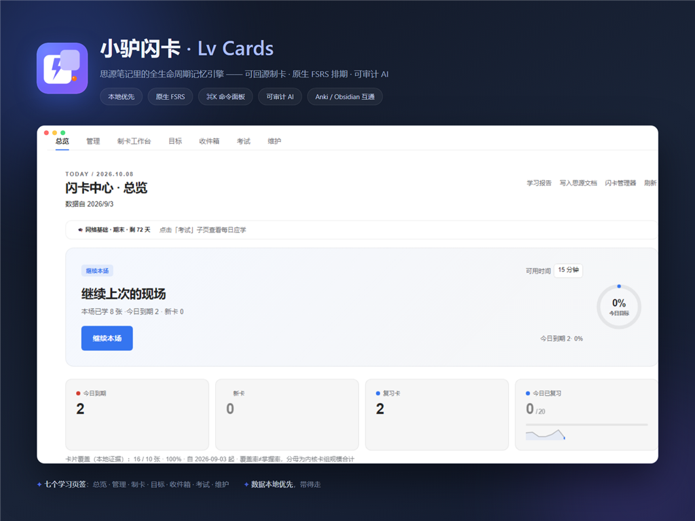

<div align="center">

# Lv Cards · 小驴闪卡

**A full-lifecycle flashcard learning platform for SiYuan — capture · create · practice · review · apply · maintain, on top of the native FSRS scheduler**

中文 ｜ [English](./README.en.md)

[](https://github.com/ai68298100/siyuan-lv-cards/releases)
[](https://github.com/ai68298100/siyuan-lv-cards/actions/workflows/ci.yml)
[](./LICENSE)
[](https://b3log.org/siyuan/)



</div>

> **Note**: The primary README and all design docs are in Chinese (the author's language). This English page covers the essentials; dive into [docs/](./docs/README.md) with your translator of choice for the full design material.

SiYuan ships a built-in FSRS flashcard system. Lv Cards aims to become its most complete local-first learning platform: absorbing proven mechanisms from Anki, Obsidian, RemNote, Quizlet, language tools, reading tools and exam products across the full lifecycle. AI already assists card generation behind a safety chain — preflight checks, prompt-injection isolation, a context budget planner and an emergency kill switch — wired through a single pipeline entry. The kernel remains authoritative for formal scheduling. Offline checks and isolated E2E pass for the current baseline; real desktop/Android walkthroughs and some host-dependent paths are still being verified.

## ✨ Features

| Module | Highlights |
|---|---|
| 🃏 **Review** | Interval preview on every rating · 4/3-button styles · forgotten-card batch re-queue (scheduling untouched) · undo · quick reschedule · type-in grading (LCS diff) · dictation mode (TTS) · multiple choice (local distractors) · image occlusion · touch swipe · source-context preview · timeout mode · session resume · **mixed question-type rotation** (flip/typing/choice by session turn — display layer only) |
| ✍️ **Create** | Block cards (multi-select) · one-click cloze from selection · quick Q/A · marker scanning (`term:: def` and `?` blocks) · AI batch generation (5 input sources + per-card regenerate + difficulty tags + **12-template prompt registry** + provider fallback) · occlusion editor · manual editing with pre-save diff preview |
| 🧭 **Learning journey** | Material inbox → one-click card generation · learning goals (purpose/deadline/daily minutes/priority/custom done-criteria with history) · content lifecycle panel (ten states + next-action suggestions + why-explanations) · entry context (doc/exam/card entries with return points) · wrap-up reasons · recovery banner · long-return check + load-relief choices · stage-count progress narrative |
| 📊 **Stats** | Heatmap (17/26/52 weeks) · True Retention · measured retention curve (PNG export) · week-over-week · milestones · capability share · error-reason distribution · XP/levels (optional) · AI batch quality & token usage |
| 🗂 **Manage** | Paged browsing · text/status/leech filters (restored on return) · sort by lapses · batch reset/remove · export selected CSV · card detail drawer (knowledge objects / relations / lifecycle) · saved filters · **maintenance debt queue** (duplicate/leak/over-long/needs-review detection + reversible pause) |
| 🎓 **Exam** | Countdown pacing + daily targets · cram mode · 30/7/1-day system notifications · post-exam report (clipboard or doc) |
| 🩺 **Data health** | Review log JSON/CSV export & import · multi-device fork detection & merge preview · storage audit · diagnostics copy (with 200-entry ring log) |
| 🔌 **Engineering** | Dual-track gateway (3.8.x riff + 3.9.0 V2 auto-detect) · 19-component UI Kit · error boundary · chunked UI (shell ≈42KB gzip ≤55KB CI-enforced; hub/review/dialogs on demand) · 500+ unit tests · isolated headless e2e (16 assertions) · zh/en i18n |
| 🛡 **AI safety** | Preflight checks (empty material / unconfigured / offline → block with alternatives, zero tokens) · prompt-injection isolation (untrusted-data fence + system clause + offline attack fixtures) · context budget (priority-layered trimming, never silently truncated, batching suggestions) · emergency kill switch (per provider/model stop, consent revoke, pending-job cleanup) |

## 🚀 Install

**Users** (SiYuan ≥ 3.8.0; platform coverage is being verified):

1. Download `package.zip` from the [latest release](https://github.com/ai68298100/siyuan-lv-cards/releases/latest) (do **not** unzip)
2. SiYuan → Settings → Marketplace → Download → "Import package" → pick the zip
3. Enable "Lv Cards" under Settings → Marketplace → Downloaded

**Developers**:

```bash
pnpm install
pnpm dev          # watch build + livereload (SiYuan running)
pnpm make-link    # symlink dist into your workspace's data/plugins/
pnpm test         # 500+ unit tests
pnpm build        # production build (emits hub/review/dialogs UI chunks)
```

## ⌨️ 30-second start

1. Select any block → click the block icon → **Add to deck**; or select text in the editor → **Cloze & make card**
2. Click the **donkey badge in the top bar**: goes straight to review when cards are due, otherwise opens the hub (empty workspace? run "Generate sample workspace" from the command palette)
3. In review: **Space** flips, **1-4** rates, `?` shows all shortcuts

## 📚 Docs

Status labels used by the project: shipped in code · real-device verified · experimental · host-dependent · planned. See the [current review and quality backlog](./docs/38-%E5%BD%93%E5%89%8D%E7%8A%B6%E6%80%81%E8%AF%84%E5%AE%A1%E4%B8%8E%E7%B2%BE%E5%93%81%E5%8C%96%E5%BE%85%E5%8A%9E.md).

Design docs and user guides are in [docs/](./docs/README.md) (Chinese): user guide (21), FAQ (20), module specs (11), interaction spec (12), UI kit spec (16), backlog (17), decisions (18/24).

## 🗺 Roadmap

Version numbers are delivery windows; the long-term roadmap has four lanes:

- **Currently deliverable**: core card creation, review, statistics, management, exams, AI generation with full safety chain, learning-journey primitives, export and platform fallbacks
- **Near-term enhancements**: journey-banner UI wiring, source-health probing UI, field-level rewrite design, language materials, course packages, application practice and content versioning
- **Host/external dependencies**: V2 card types, live media, deep series integration, Anki extensions and cloud AI
- **Long-term exploration**: cloud sync, collaboration, content marketplace, full incremental reading, standalone clients and widgets

Capabilities that are not yet feasible remain tracked with dependencies, fallbacks and review conditions; they are not removed from the product vision. See the [layered roadmap](./docs/04-路线图.md) and [full product strategy](./docs/27-产品使命与全功能战略.md).

## 🙏 Credits

- Built on [plugin-sample-vite-svelte](https://github.com/siyuan-note/plugin-sample-vite-svelte)
- Scheduling is 100% the SiYuan kernel's [go-fsrs](https://github.com/open-spaced-repetition/go-fsrs)
- Feature research: Anki & add-ons, Obsidian Spaced Repetition, RemNote, Logseq, Mochi, Quizlet, Brainscape, 墨墨, 滑记, MarginNote, Knowt, and SiYuan community plugins

## License

[MIT](./LICENSE) © ai68298100
