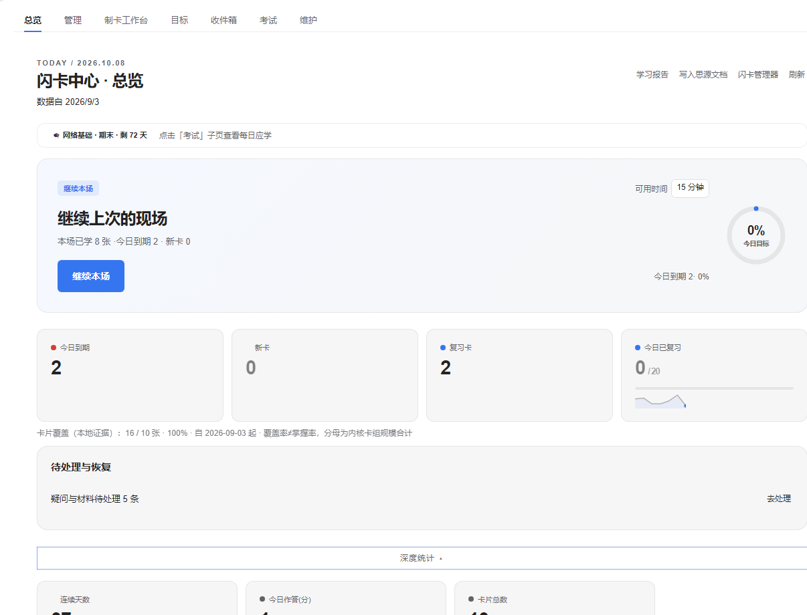
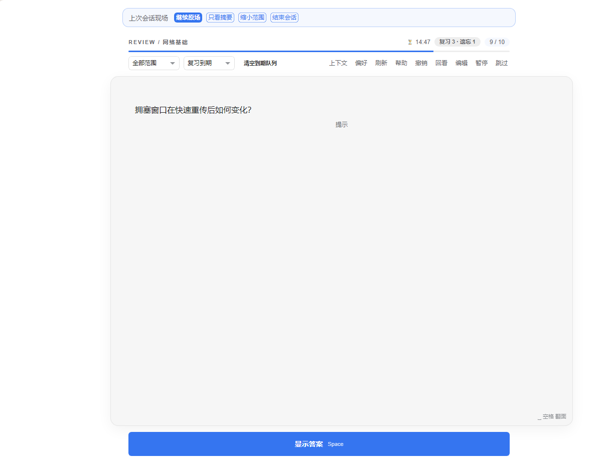
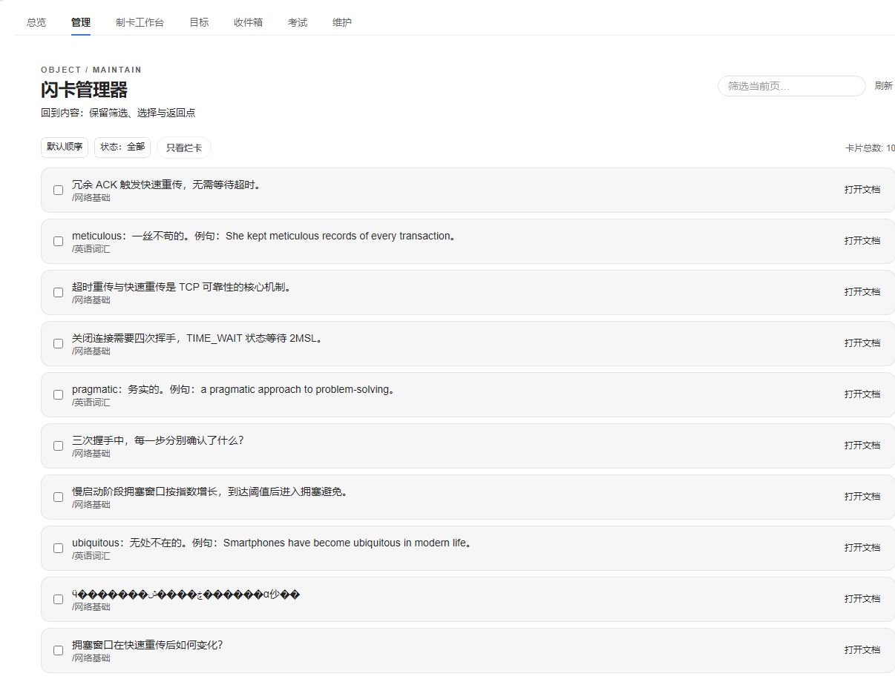
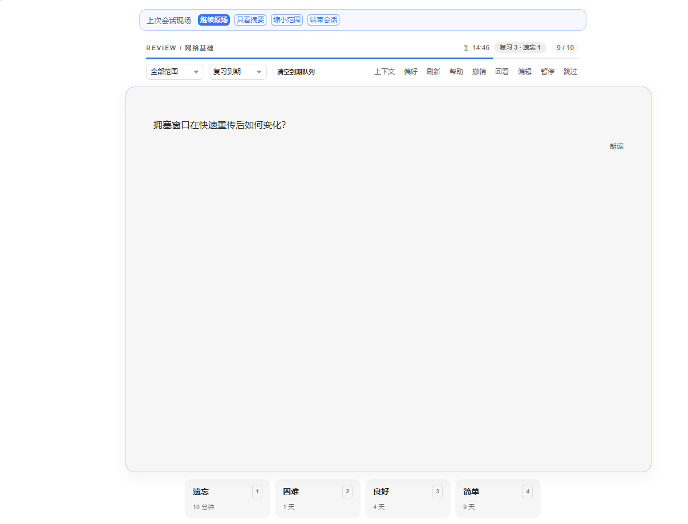

> **内测说明**：小驴闪卡（内测版）当前仍有部分能力处于开发与测试阶段。欢迎参与内测体验，并通过交流 QQ 群 **871707735** 反馈 Bug、提交功能需求。若您对功能完整性和运行稳定性有较高要求，建议等待正式版发布后再使用。项目会持续更新迭代，感谢您的理解与支持。

<div align="center">

# 小驴闪卡（内测版）

**让笔记成为记得住、用得上的长期知识。**

思源笔记的全域闪卡学习平台 · 本地知识与原生 FSRS 复习 · 可审计的 AI 辅助学习

中文 ｜ [English](./README.en.md)

[](https://github.com/ai68298100/siyuan-lv-cards/releases/latest)
[](https://github.com/ai68298100/siyuan-lv-cards/actions/workflows/ci.yml)
[](./LICENSE)
[](https://b3log.org/siyuan/)

[下载安装](#安装) · [开始使用](#开始使用) · [AI 如何参与](#ai-如何参与学习) · [设计规范与原型](./docs/42-UI设计规范-R53.md)

</div>

小驴闪卡（内测版）的定位是**思源笔记里的全生命周期记忆引擎**：让笔记里每一段值得记的内容，都能可回源地变成卡片，用内核原生 FSRS 排期，用可审计的 AI 提效；数据本地优先，方便带走。

当前发布版本为 **v0.209.2（2026-10-10）**。本次为集市清单兼容修订，只调整插件 metadata，不改变功能；上一版本收口了入口、按钮忙碌态、加载错误和重试反馈，并修复挑战退出及拒绝重复添加时的副作用。

[下载最新版](https://github.com/ai68298100/siyuan-lv-cards/releases/latest) · [提交问题](https://github.com/ai68298100/siyuan-lv-cards/issues/new/choose) · [贡献指南](./CONTRIBUTING.md)

## 本次更新（v0.209.2）

本版本修正集市上架所需的清单 metadata，不改变插件功能。

优化：清单兼容性

- 支持平台改为明确的平台列表，不再混用 `all`。
- 移除未配置的赞助占位字段。

## 上一版本功能更新（v0.209.1）

本版本根据入口、前置条件、按钮状态、错误反馈和页面文案核对结果，补齐可恢复的交互状态。

新增：加载失败后的恢复路径

- 总览刷新失败时保留上次成功的数据，并标注数据时间。
- 卡组、笔记本、维护、挑战、配对和收件箱等操作提供清楚的加载、错误、空态或重试反馈。
- 复习空队列提供范围切换，可直接尝试其他卡组或范围。

优化：按钮状态与操作反馈

- 保存、评分、批量操作和加载期间禁用重复提交；失败时保留当前设置或选择。
- AnkiConnect 测试使用当前编辑的地址与密钥；AI 笔记本来源显示读取进度和不可用原因。
- 中英文页面文案、内测说明和原型与现状的边界说明保持一致。

修复：异步退出与重复操作

- 挑战加载期间退出后，不再继续读取卡面或启动计时器。
- 拒绝重复制卡确认时，不会提前创建输入中的新卡组。
- 补齐新增设置反馈的中英文文案键。

验证：`pnpm check`、736 项单元测试、i18n、治理、文档事实、生产构建和发布包 smoke 全部通过。Android 思源真机完整矩阵仍待单独验收。

<details>
<summary>历史版本更新（点击展开）</summary>

### v0.209.0 · 2026-10-09

本版本基于十二轮全方位审计，重点修复核心制卡、挖空、到期队列和 AI 安全问题。

- 修复思源 3.8.x 下快速制卡、示例卡和标记制卡失败，以及挖空卡问题态答案泄露。
- 修复“全部范围”到期队列为空、知识对象面板崩溃、AI 安全阀不可见和拒答错误信息异常。
- 修复遗忘原因标注、练习设置即时生效及画像应用确认框名称；统一快捷键和复习术语。

### v0.208.1 · 2026-10-08

- 修复 AI 制卡向导、修卡演练和卡片详情操作的入口回调，并为懒加载失败补上可见反馈。

### v0.208.0 · 2026-10-08

- 完成 Starline R53 视觉体系提质，覆盖页头、复习流程、状态、窄屏布局和动效。

完整历史请查看 [CHANGELOG](./CHANGELOG.md)。

</details>

## 小驴系列插件与交流

小驴系列插件彼此独立，可按需安装和组合使用：

| 插件名称 | 一句话简介 | GitHub 仓库 |
|---|---|---|
| [小驴雷切](https://github.com/ai68298100/siyuan-speed-switch) | 思源中的统一导航与工作上下文平台，连接页签、工作台、片段和快捷入口。 | [ai68298100/siyuan-speed-switch](https://github.com/ai68298100/siyuan-speed-switch) |
| [小驴打卡](https://github.com/ai68298100/siyuan-checkin) | 本地优先的习惯、目标打卡与复盘工作台，支持统计、提醒和笔记联动。 | [ai68298100/siyuan-checkin](https://github.com/ai68298100/siyuan-checkin) |
| [小驴人脉](https://github.com/ai68298100/siyuan-contacts) | 在思源中管理联系人、人际关系、组织归属和生日提醒。 | [ai68298100/siyuan-contacts](https://github.com/ai68298100/siyuan-contacts) |
| [小驴拾遗](https://github.com/ai68298100/siyuan-glean) | 整理思源剪藏和导入文章，支持状态分拣、阅读管理与日后回顾。 | [ai68298100/siyuan-glean](https://github.com/ai68298100/siyuan-glean) |
| [小驴考试（内测版）](https://github.com/ai68298100/siyuan-exam) | 本地题库备考工作台，支持多格式导入、刷题、背诵、模考、错题复盘与 AI 辅助。 | [ai68298100/siyuan-exam](https://github.com/ai68298100/siyuan-exam) |
| [小驴管家（内测版）](https://github.com/ai68298100/siyuan-home) | 管理家庭与生活资料、成员档案、台账、到期提醒和事务跟进。 | [ai68298100/siyuan-home](https://github.com/ai68298100/siyuan-home) |
| [小驴闪卡（内测版）](https://github.com/ai68298100/siyuan-lv-cards) | 思源中的知识捕获、制卡、练习与复习平台，使用内核原生 FSRS 排期。 | [ai68298100/siyuan-lv-cards](https://github.com/ai68298100/siyuan-lv-cards) |
| [小驴常用（内测版）](https://github.com/ai68298100/xiaolv-common) | 基于思源块快速调用常用语、模板、代码、链接，并支持变量填充。 | [ai68298100/xiaolv-common](https://github.com/ai68298100/xiaolv-common) |

交流 QQ 群：**871707735**（反馈 Bug、提交需求、交流使用体验）

## 界面速览

| 总览——今天从哪里继续 | 专注复习——先回忆，再对照，最后自评 |
|---|---|
|  |  |
| **管理**——回到内容，保留来源与历史 | **评分条**——四档自评，间隔预览 |
|  |  |

## 它适合怎样的学习

| 你的需求 | 从这里开始 | 后续希望连起来的过程 |
|---|---|---|
| 把自己的笔记变成长期知识 | 从思源块、挖空或快速问答建卡 | 回源查证、内容修订、应用与长期维护 |
| 记术语、词义和概念 | 主动回忆，或使用打字、朗读等辅助方式 | 词义与语境、原音听力、输出练习 |
| 为课程和考试准备 | 按卡组复习，建立考试计划 | 章节目标、前置知识、投入预演、应用证据 |
| 减少重复整理卡片的工作 | AI 生成问答/挖空候选，人工审核后入组 | 来源审核、定向改写、冲突识别、思源智能体协作 |

小驴持续围绕六个结果设计：**记得住、用得上、找得到、改得动、负担得起、带得走**。卡片数量、连续天数和 AI 生成量只是过程数据；是否学会，还需要看真实回忆、解释和应用。

## 当前功能

以下按 v0.209.1 的代码与版本记录整理，具体使用还受宿主能力、设置和设备影响。

| 能力 | 当前提供 |
|---|---|
| **笔记制卡** | 块菜单添加到卡组、多选批量、选中文字挖空、快速问答、扫描 `术语:: 定义` 和 `？` 结尾标记 |
| **主动回忆与复习** | 题面与答案、三/四档自评、内核间隔预览、来源上下文、跳过、今天不学、回看、忘记卡本批重现、**分级提示阶梯** |
| **辅助练习** | 打字对照（LCS diff）、TTS 朗读/听写、选择题（本地干扰项）、配对练习、图片遮挡、混合题型轮换 |
| **本场控制** | 本场偏好弹层、时间预算（倒计时 HUD）、超时模式、会话恢复 |
| **学习旅程** | 材料收件箱→制卡工作台、学习目标（三步链+每日投入）、内容状态面板、入口上下文、收工原因、中断恢复、返场检查、下一步建议 |
| **卡片管理** | 分页浏览、文本/状态/筛选、批量操作、卡片详情抽屉（内容/来源/学习记录/问题四分面 + 版本追踪）、选中卡导出 CSV/Obsidian SR、维护债务队列 |
| **考试计划** | 截止日期与范围、每日建议量、进度、cram 冲刺入口、考试复盘 |
| **统计与诊断** | 热力图、**学习日历与负载预测**（过去热力/未来负载）、**卡组仪表盘**（按卡组聚合排行）、连击、保持率与间隔分桶曲线、能力分布、错误原因分布、AI 批次记录 |
| **数据迁移** | Obsidian SR 双向导入导出（卡组映射+指纹幂等）、Anki `.apkg` 导入（仅在桌面宿主同时提供 `node:sqlite` 与 `node:zlib` 时显示入口）、选中卡 CSV、日志 JSON/CSV 导出导入合并 |
| **⌘K 命令面板** | 动作+导航两分组，键盘直达全部入口 |
| **每周学习报告** | 设置开启后，每周自动把上周复盘写入思源文档 |
| **分享包** | 整卡组导出为 Obsidian SR markdown，可分享给他人或 Obsidian 用户，导入自动映射同名卡组+指纹去重 |
| **AI 制卡（全链安全）** | 思源 AI 或自定义端点（主备回退）、12 个提示词模板、生成→预览→逐卡审核→入库、**前置检查/注入隔离/上下文预算/紧急停用**四道安全门 |
| **偏好与帮助** | 模块开关、画像预设、界面模式、字号/密度、提醒/免打扰、朗读/音效、内置帮助与示例工作区、中英界面 |

本地统计主要来自插件记录的日志。曲线中的固定理论参考、样本保持率和内核数据有不同口径，不能据此直接宣称掌握或学习效果。日志导入与导出不等于完整学习包迁移。

## 界面与设计体系

插件使用 **Starline R53 视觉体系**（[设计规范](./docs/42-UI设计规范-R53.md)）：7 条设计原则、完整令牌表、13 个组件解剖与状态矩阵、14 面逐页规格。核心原则：

- **一屏一问**：每屏只回答一个主问题，其余渐进展开
- **主色即动作**：品牌色只出现在当前唯一主动作上（≤5% 覆盖率）
- **来源可见**：AI 生成的内容必须就近给出依据
- **状态即设计**：六类状态与正常态同精度设计
- **键盘优先**：⌘K 命令面板 + 全快捷键 + kbd 可见

v0.208.0 起该体系完成全面落地：统一页头（眉线 + 题 + 副题 + 动作组）、分段复习进度条、零值/空态/错误态同精度呈现、克制的三档微动效（数字滚动 / 切页淡入 / 对话框入场，尊重 `prefers-reduced-motion`）、页签与徽章语义校准、亮暗双主题同一令牌域。

可交互评审原型：[Starline R53](./docs/prototypes/starline-r53.html)（14 面，亮/暗/390px，固定虚构数据，不连接思源或模型）。设计决策与竞品调研见[docs/41](./docs/41-竞品调研与定位强化.md)。

## AI 如何参与学习

**AI 是产品的核心方向**——但 AI 的价值在"可审计"而非"能生成"。每个 AI 任务都配合来源、人工判断与无需 AI 的操作路径。

当前 AI 制卡可使用**思源设置中的 AI 服务**或**自定义兼容端点**，生成问答/挖空候选，再预览、编辑、选择并创建到卡组。内置 **12 个提示词模板注册表**，支持自定义模板。

**AI 安全四道门**（请求前到落盘全链）：

- **前置检查**：材料为空、AI 未配置、离线时阻断并给出手工替代（零 token）
- **注入隔离**：来源以不可信数据围栏包裹，离线攻击 fixture 持续回归
- **上下文预算**：超长材料分层裁剪+分批建议，截断有可见标记
- **紧急停用**：按 provider/model 粒度停用/撤销同意/清理待发队列；已有卡片与复习完全不受影响

### AI 与数据范围

核心制卡、复习、管理和导出可以**不配置 AI** 使用。卡片和笔记由思源保存，插件设置与本地日志保存在思源工作空间内。AI 制卡会把材料发送到你配置的服务商。详见[隐私说明](./docs/PRIVACY.md)。

## 安装

最低声明为 **思源 3.8.0**。桌面端为核心体验；移动端与浏览器端已做窄屏适配（390px 结构化走查通过），Android 思源真机完整矩阵仍待执行，具体功能差异仍需按设备验证。

1. 到 [GitHub Releases](https://github.com/ai68298100/siyuan-lv-cards/releases/latest) 下载 `package.zip`。
2. 在思源 **设置 → 集市 → 下载** 中使用"导入安装包"，选择该 ZIP，无需解压。
3. 在已下载插件中启用"小驴闪卡（内测版）"。

当前以 GitHub Release 安装包分发，**思源集市上架暂缓**。没有安装包导入入口的设备，请按该宿主提供的插件安装方式操作。

## 开始使用

1. 在思源文档中点击块左侧图标，选择**添加到卡组**，选一个卡组或新建卡组。
2. 按 **Ctrl+K** 打开命令面板，或点击顶栏的**小驴闪卡（内测版）图标**：有到期卡时进入复习，无到期卡时打开闪卡中心。
3. 在问题态按**空格显示答案**，再按 **1—4** 自评：遗忘、困难、良好、简单。三档设置使用 1—3。
4. 到闪卡中心查看总览、管理卡片或查看学习日历；不清楚操作时，在复习面板按 `?` 查看帮助。

<details>
<summary>常用入口与示例</summary>

| 入口 | 用途 |
|---|---|
| **Ctrl+K 命令面板** | 动作+导航键盘直达（开始复习/快速制卡/切页签等） |
| 顶栏图标 | 单击进入复习/中心；右键打开功能菜单 |
| 块菜单 | 添加到卡组、挖空制卡、从卡组移除等 |
| 文档面包屑 | 宿主提供所需接口时可出现"复习本文档" |

没有材料时可用"生成示例工作区"命令体验。

</details>

需要更详细的操作，见[上手指南](./docs/21-用户上手指南.md)与[FAQ](./docs/20-FAQ与故障排查.md)。反馈问题可到 [Issues](https://github.com/ai68298100/siyuan-lv-cards/issues)，安全问题请按 [SECURITY](./SECURITY.md) 的私密渠道报告。

## 路线图

| 优先级 | 项目 | 状态 |
|---|---|---|
| P0 | ⌘K 命令面板 | ✅ v0.206.3 |
| P0 | 学习日历与负载预测 | ✅ v0.206.4 |
| P1 | 每周学习报告 | ✅ v0.206.7 |
| P1 | 卡组仪表盘 | ✅ v0.206.8 |
| P1 | 分享包（Obsidian SR 整组导出） | ✅ v0.206.9 |
| P2 | 390px 窄屏结构化走查 | ✅ v0.206.10 |
| P1 | Starline UI 全面提质（页头体系/状态完备/微动效/窄屏/复习流程精修） | ✅ v0.208.0 |
| P2 | Android 思源真机完整矩阵 | 待执行 |
| P2 | 模板与字段 | 等核心闭环稳定后开启 |

完整方向见[产品使命](./docs/27-产品使命与全功能战略.md)、[竞品调研与定位](./docs/41-竞品调研与定位强化.md)和[分层路线图](./docs/04-路线图.md)。

## 文档与参与

| 想了解什么 | 阅读入口 |
|---|---|
| 使用与排错 | [上手指南](./docs/21-用户上手指南.md) · [FAQ](./docs/20-FAQ与故障排查.md) · [隐私说明](./docs/PRIVACY.md) |
| 定位与 AI 方向 | [产品使命](./docs/27-产品使命与全功能战略.md) · [竞品调研与定位](./docs/41-竞品调研与定位强化.md) · [AI 战略](./docs/29-AI战略与内置提示词体系.md) |
| 设计规范与原型 | [R53 设计规范](./docs/42-UI设计规范-R53.md) · [R53 原型](./docs/prototypes/starline-r53.html) · [交互规范](./docs/12-交互设计规范.md) |
| 参与开发 | [CONTRIBUTING](./CONTRIBUTING.md) · [执行顺序](./docs/30-待办治理与执行顺序.md) · [待办](./docs/17-待办清单.md) · [文档导览](./docs/README.md) |

<details>
<summary>开发环境与检查命令</summary>

使用 Node.js ≥ 24、pnpm 12；项目基于 TypeScript、Svelte 5 和 Vite。

```bash
pnpm install
pnpm make-link    # 将 dist/ 链接到本机思源工作区，具体配置见 CONTRIBUTING
pnpm dev          # 监听构建，开发环境需运行思源
pnpm check        # 类型、Svelte 与版本检查
pnpm test         # 单元测试（数量以当前 CI 结果为准）
pnpm build        # 生产构建（含 hub/review/dialogs 三个 UI chunk）
node scripts/e2e-isolated.mjs   # 隔离式后台 e2e（临时工作区+无头内核，18 项断言）
pnpm release      # 交互式同步版本并运行检查；不等于发布到外部平台
```

启动体积按 chunk 分治：Vite 报告主包 gzip ≈52.92KB（治理门禁按 KiB 计约 51KB，≤55KB），闪卡中心/复习/对话框 chunk 分别约 61.23/36.57/59.21KB，按需加载。正式调度以思源内核为准。工程细节见[架构决策](./docs/24-架构决策记录.md)与[扩展契约](./docs/14-扩展架构与数据契约.md)。

</details>

## 致谢与许可

构建于思源官方 [plugin-sample-vite-svelte](https://github.com/siyuan-note/plugin-sample-vite-svelte) 模板之上，使用思源内核的原生 FSRS 调度。能力研究参照 Anki、RemNote、Quizlet、Mochi、Obsidian Spaced Repetition、语言与阅读工具，以及思源社区的相关插件；调研与定位分析见[docs/41](./docs/41-竞品调研与定位强化.md)。

[MIT](./LICENSE) © ai68298100
