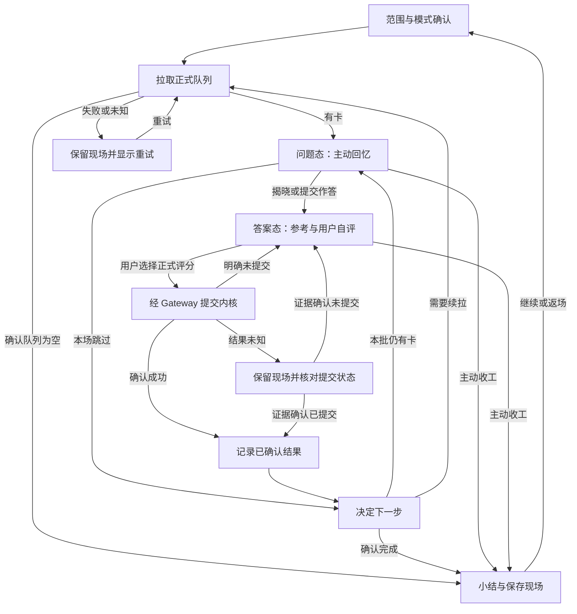

# 小驴闪卡 · 交互设计规范

> R50 · 交互规格 v1.0（2026-10-02）。配套：[13-UI原型图](./13-UI原型图.md)、[32-产品体验优化与页面蓝图](./32-产品体验优化与页面蓝图.md) v1.0；排期以 [30-待办治理与执行顺序](./30-待办治理与执行顺序.md) v1.2 为准。
>
> 本文是目标交互规则，不代表全部已经实现或通过真机验收。本轮只更新规划。当前中心代码有总览、管理、可选考试，AI 向导是配置/候选两个画面；数据任务面、材料工作台和搜索预览设置均为规划。交互总原则：**任务连续、主动作清楚、键鼠触屏等价、失败保留现场**。

## 1. 入口与导航

### 1.1 入口行为细则

| 入口 | 触发 | 行为 | 备注 |
|---|---|---|---|
| 顶栏图标 | 左键/单击 | 有到期时打开复习；无到期时打开中心，提供材料、练习、应用或维护的下一步 | 到期查询失败显示未知与重试，不当成 0；保留上次范围与返回点 |
| 顶栏图标 | 右键/长按 | 菜单：V2 徽章(只读) → 今日摘要(只读) → 闪卡中心 → 开始复习 → 设置 | 移动端长按 0.5s |
| 顶栏角标 | — | 今日到期数；0 张时隐藏；>99 显示 99+ | 心跳 60s；移动端降级 |
| 命令面板 | — | 「开始复习」「打开闪卡中心」「快速制卡」；任务与设置可搜索进入 | 命令热键走思源配置，不能把规划热键写成已实现 |
| 块右键菜单 | 选中 1-N 块 | 添加到卡组 / 快速制卡 / 卡片信息 / 从卡组移除 | 无卡块与有卡块菜单项不同 |
| 面包屑按钮 | 单击 | 复习本文档 | 待验证 LEGACY-B-02/AR-1 的接口、注入与平台适配；缺能力退块菜单/命令 |
| 悬浮球 | 单击/拖动/长按 | 复习 / 移动 / 设置；与胶囊启动器拼合 | 仅移动端 |

### 1.2 导航结构

```
顶栏 ─ 左键 ── 有到期 ► 复习面板（Tab，可停靠）
      │        无到期 ► 闪卡中心（保留目标与返回点）
      └ 右键菜单 ──┬──► 闪卡中心（Tab）
                    │     ├ 总览（当前已有；今日任务优先为规划）
                    │     ├ 管理
                    │     └ 考试（模块可用时）
                    │   按上下文进入：材料审核 / 结果 / 待处理与恢复（规划）
                    └──► 设置（Dialog）
编辑器 ─ 块菜单/面包屑 ─► 制卡 Dialog / 复习面板(文档范围) / 卡片详情抽屉
```

规则：

- 开始复习保留直接动作；无到期不强迫用户进入空复习页。入口说明本场范围、模式、是否产生正式评分和结束条件。
- 切子页、进详情、跳来源再返回，保留查询、排序、页码、选中语义、滚动和焦点。错误边界重建与用户状态保存分别负责，不能用重挂载清空现场来修错。
- 容器按任务时长和上下文选择：短确认可用 Dialog；多材料、长时间审核和可恢复作业使用工作面/Tab/抽屉等合适容器。材料、任务、审核、结果是状态，不强制固定步数；状态可回看和恢复。
- 每个阶段一个清楚主动作；揭晓后的评分档位是同级选择，不把某个正式评分包装为唯一推荐按钮。高级能力按上下文展开，并保留搜索入口，不因扩展模块就增加主 Tab。

## 2. 复习会话状态机（核心）



这是目标交互状态，不表示现版已实现全部分支。先确认正式写入，再推进已评分计数；提交结果未知时保持未决，不能自动重放评分、伪造撤销或直接标完成。核对能力不足时明确限制并保存待处理现场。AI/打字相似提示不触发正式提交；跳过与主动收工保留真实 due，走本场呈现与快照契约。

### 2.1 Question 态（问题阶段）

- 显示：题面（来源块渲染）+ 头部（范围名 · 进度 n/N · 模式）+ 主动作（显示答案）+ 按需元信息与操作（跳过 / 今天不学 / 编辑 / 打开来源）。来源、标签和上下文若泄露答案，应延后或遮蔽。
- **点击翻面热区 = 卡面空白与页脚**；卡面内输入控件、链接、代码块点击不翻面（为打字题与富交互预留）。
- 打字模式：题面下方出现作答输入框，明确提交后展示参考与 diff；输入法组合期间的回车只确认文字，不提交。建议分、相似度或信心不自动成为正式评分。
- 超时默认只提醒或揭晓，不自动提交正式评分；后台暂停/持续计时按明确策略显示。超时自动评分的研究不作为当前默认体验，任何正式写入须符合内核契约和明确用户选择。

### 2.2 Answer 态（答案阶段）

- 正式 rating 仅为整数 1—4。四档为遗忘/困难/良好/简单；三档界面必须显式说明不认识→1、模糊→2、认识→3，不暗中制造第五档。1—5 信心自评属于旁路用户事实，与正式 rating 分账。
- 每键两行：主标签 + 下次间隔（只用内核 nextDues，缺失显示未知）。采用文字与数字双编码，按键只有揭晓后、无阻断浮层且未提交时有效。
- 撤销只通过 Gateway 支持的内核恢复/undo 契约，说明可撤销范围；恢复本地画面不能冒充正式评分已撤销。`u` 或完成页入口的可用性需逐宿主验证。
- 回看上一张：`[` 键，弹出只读浮层（前一张问题+答案），`Esc` 关闭，不产生任何调度副作用。

### 2.3 特殊动作

| 动作 | 语义 | 契约与验收边界 |
|---|---|---|
| 跳过 | 本场跳过，不产生正式评分 | 按支持的 skip 契约执行；跳过事件/数量与正式 revlog 分账，不向正式 revlog 写 rating=0 |
| 今天不学 | 暂停本学习日的呈现，保留历史 | 到期边界服从统一学习日/时区策略；本地屏蔽与内核 buried 明示区别，官方能力需探测 |
| 改期 | 预览目标时间、范围与影响，再确认 | 正式 due 只经 Gateway/内核；当前整数天与未来自然语言分别验收，不把规划解析能力当现状 |
| 编辑 | 跳编辑器并定位块 | openTab zoomIn |

### 2.4 队列规则

- 正式队列与 due 来自内核/Gateway。呈现顺序与旁路混合练习分别说明；插件不另建正式 FSRS 或凭推荐制造到期。
- 考试计划激活时：队列 = 计划范围过滤（M7·FR3），头部显示计划进度条，可一键暂停计划回普通复习。
- 深度：每批按内核上限；批耗尽自动续拉，间隔 300ms 防抖；全空 → Done 态。

### 2.5 Done 态（会话小结）

显示本场新卡/复习/遗忘/跳过/用时、事实来源与缺失；区分已完成、时间到、精力不足、待解疑问和用户主动结束。正常收工保留现场及真实剩余 due，下一步可为回源修订、继续、稍后或结束，不只推动“再来一批”。撤销是否可用取决于内核契约；可选庆祝不遮挡主动作。详见 32 的结果→下一步蓝图。

## 3. 键盘映射

| 键 | 问题态 | 答案态 | 任意 |
|---|---|---|---|
| `Space`/`Enter` | 翻面（打字题：提交） | 评"良好"(3) | |
| `1`-`4` | — | 评分 1-4 | |
| `x` / `0` | 跳过 | 跳过 | |
| `u` / `p` / `q` | 撤销上一评 | 撤销上一评 | |
| `[` | 回看上一张 | 回看上一张 | |
| `s` | 今天不学 | 今天不学 | |
| `e` | 编辑原块 | 编辑原块 | |
| `f` | 快速改期 | 快速改期 | |
| `Esc` | — | — | 关浮层/退出回看 |

规则：输入框、搜索、可编辑内容、媒体或模态层聚焦时不触发页面评分/翻面；`isComposing`、IME 确认、长按重复键、文本选区和滚动须有独立 fixture。揭晓前禁止数字正式评分，揭晓后一次动作最多写一次。命令热键由宿主配置；面板内重映射是规划，需单独检查冲突。

## 4. 手势（移动端）

| 手势 | 区域 | 问题态 | 答案态 |
|---|---|---|---|
| 右滑 | 明确的卡面手势区域 | 不正式评分 | 评"良好"（3），支持时可关 |
| 左滑 | 明确的卡面手势区域 | 不正式评分 | 评"遗忘"（1），支持时可关 |
| 上滑 | 明确的翻面热区 | 确认为翻面意图后揭晓 | 不提交评分 |
| 单击 | 卡面空白 | 揭晓 | 不隐式提交评分 |
| 长按 0.5s | 卡面 | 操作面板（跳过/今天不学/改期/编辑） | 同左，不吞原生选区 |
| 下滑 | 头部指定区域 | 结束/保存现场，有进度时解释影响 | 同左 |

手势与按钮映射一致，并保留按钮等价路径。长内容纵滚、表格/代码横滚、缩放、文本选择、媒体控件、原生边缘返回与输入法优先；触摸之后合成 click 不得重复揭晓或评分。当前源码的横滑阶段守卫问题归入 AS-2 验收，本表不能当作已修复证据。滑卡反馈尊重系统减弱动态设置。

## 5. 反馈系统

| 层级 | 载体 | 用于 |
|---|---|---|
| 即时 | 按钮按下态/评分动画/进度条 | 每次评分 |
| 轻提示 | snackbar（2-3s） | 已改期/已加入卡组/已屏蔽今日/撤销成功 |
| 确认 | confirm Dialog | 批量操作、重置、清空数据（显示影响数量） |
| 庆祝 | 全屏轻量彩带（≤2s，可关） | 达成每日目标/连胜里程碑 |
| 常驻 | 顶栏角标/中心头部条 | 到期数/目标进度/V2 状态/考试倒计时 |
| 错误 | 内联红字 + 重试按钮 | 拉取失败（保留当前会话现场，不清屏） |

原则：统计/激励失败不阻断正式评分；写入中、成功、失败、取消、过期和未知必须区分。错误按网络、权限、宿主不可达、来源失效、解析和容量给出可执行动作，不能统一归因“思源未运行”。刷新已有数据时保留最近有效结果、更新时间和过期标记；toast/读屏只播报一次。

## 6. 空状态与引导

| 场景 | 文案方向 | 动作 |
|---|---|---|
| 全库无卡 | 「选择一段值得学习的材料」 | 保存来源 / 手工制卡 / 使用可删除的本地示例 |
| 范围内无到期 | 「这个范围目前没有到期卡」 | 换范围 / 纯练习 / 维护；不等于目标全部掌握 |
| 筛选无结果 | 显示范围与生效条件 | 清除筛选 / 调整查询；不显示“库为空” |
| 内核无响应 | — | 重试 |
| V2 LegacyDiverged | 「检测到迁移后旧数据有写入」 | 可用诊断/帮助入口；统一恢复任务面为规划，未实现时说明人工路径 |
| 首次启动 | onboarding 三步 | 见 §7 |

## 7. 首次启动引导（规划目标；时长需用户研究）

1. **选画像**：备考 / 笔记 / 语言（单选卡片，说明各自开什么）。
2. **建第一张卡**：贴一段文字 → 一键生成 3 张示例卡（本地演示，真数据）。
3. **复习 3 张**：直接进入复习面板完成第一场 → 完成页展示统计页入口。

上列是示范流程，不强制三步或固定数量。允许只记录目标、保存材料、不启用 AI；示例标明来源和删除方式，创建失败保留可恢复现场且重试幂等。跳过、稍后、取消、完成有各自持久化语义；首用达成、耗时和困惑需 AU-5/用户研究取证，不能宣称已验证“≤60 秒”。

## 8. 移动端适配规则

- 复习面板：全屏无 Dialog；头部压缩为单行（范围 · n/N · 倒计时）。
- 闪卡中心：导航保持 Tab 语义，窄屏可横滚；图表按设备能力降采样并提供可读数据表，九周是候选参数而非一律截断。
- 悬浮球：默认右下，可拖动记忆位置；到期数角标同步。
- 触控目标 ≥ 44px；评分按钮全宽等分。
- 性能参数由本插件基准与宿主能力验证；缓存/并发/前后台刷新不照搬其他插件阈值。恢复前台先检查有效性，刷新失败保留现场，旧响应不覆盖新范围。

## 9. 无障碍与本地化

- 颜色基于 b3 主题变量，但派生不能代替对比度验收；亮暗、第三方主题、缩放、窄屏与 reduced motion 均需检查。评分四档除颜色外带文字/数字双编码。
- 全部可达操作有键盘等价（§3）。
- i18n：zh-CN / en 为目标验收范围，完整性以词表和实测为准；文案不硬编码，日期显示与存储时间策略分别负责。
- 动画尊重 `prefers-reduced-motion`。

## 10. 材料、审核、设置与待处理任务面（R50 规划）

- 材料面必须显示并允许编辑实际材料；加载区分替换/追加，来源逐项可去除，外发范围与发送一致。多材料、超长材料和中断作业不强绑短 Dialog。
- 审核以稳定候选身份保存来源、人工编辑、问题/答案真实预览和差异。选中不等于已审；接受/编辑/拒绝/待核实/稍后分开，未审不进正式队列。窄屏切换来源、编辑、预览时仍处于同一卡。
- BX-3 的本场偏好区分全局默认、目标/范围与本场覆盖，冲突模式显式互斥；BX-4 设置可按任务搜索，显示作用域、覆盖、生效时机和不可用原因。外观/声音使用本地样例预览，不改真实卡或评分；取消丢弃草稿的影响需说明，保存失败不关闭。
- 待处理与恢复通过今日卡、对象详情或命令进入，显示检查点、影响和继续/修复/跳过/导出现场。作业、维护、权限与恢复可以同屏发现，但仍按各自工作包验收，不强加一个数据 Tab 或合并事实源。
- 文案与反馈强调“发生了什么、依据是什么、下一步能做什么”；未知、取消和尚未支持不可伪装成完成。对应明细与新增切片登记在 32，执行顺序服从 30。
