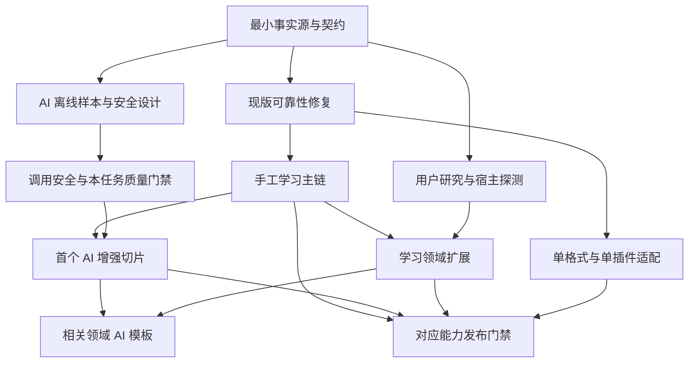

# 小驴闪卡 · 待办治理与执行顺序

> 版本：待办治理基线 v1.2（2026-10-02，R52 原型质感与场景夹具补充）
>
> 定位依据：[27 产品使命](./27-产品使命与全功能战略.md) → [28 用户逻辑](./28-用户逻辑与终局产品模型.md) → [29 AI 战略](./29-AI战略与内置提示词体系.md)。本轮只整理规划，不进行功能开发。
>
> [17 待办清单](./17-待办清单.md)保留历史编号、状态与逐项验收；[31 工作包索引](./31-待办工作包索引.json)登记每条明细的唯一主要归属；[32 产品体验优化与页面蓝图](./32-产品体验优化与页面蓝图.md)补充任务面与验收。本文是后续排期与依赖治理依据，不能按 A→BX 的字母顺序开发，也不能按旧版本窗口重做已经实现的功能。

## 1. 本轮结论与当前基线

产品要覆盖完整闪卡能力，但交付仍围绕“记得住、用得上、找得到、改得动、负担得起、带得走”六项结果。**先把一条可靠的学习旅程连起来，再拓展题型和场景；AI 从设计期参与，按具体任务增量交付。**

当前 `package.json`/`plugin.json` 均为 v0.207.2，最低宿主声明为 3.8.0。已有复习、中心、考试、AI 制卡等代码，不是重新开始骨架开发。AQ-1/AQ-2 已在后续版本修复并有代码/回归记录；当前仍需按 docs/34 验证桌面和移动设备。代码存在、历史勾选、离线测试和真机验收是不同证据；本文件的 R52 是治理方案基线，最新实现和执行评审以 [docs/43 当前状态审计与开发交接](./43-当前状态审计与开发交接.md) 为准，docs/36 与 docs/38 保留为历史盘点窗口。

当前清单实数为 **935 条：194 条已勾选、738 条普通未完成、3 条特殊状态**；未完成含特殊共 741 条。该统计已随 R53-BZ 后续规划条目增长；历史 R49/R50/R52 校验记录保留于下文，不作为当前条目数。它们继续归入 **38 个规范工作包**，每条只有一个主要归属；38 包是责任方向，不是 38 个 sprint，也不代表已实现或已验收。

本轮调整：

- 同一能力在早期模块、审计、用户旅程和 AI 规划中重复出现；融合共同交付对象，保留不同验收范围。
- 原 15 包偏重横向底座；补齐制卡、管理、语言、课程、应用、研究、维护等业务主归属。
- 完整宿主矩阵、全部 AI 模板不再充当前置；改为本次切片所需最小契约与逐能力门禁。
- 插件发布、学习包分发、教师蓝图和市场运营分别验收，共用许可、隐私与发布规则。
- 真实修复、基础设施、研究线索、长期探索分别排期；历史 P0 标签不直接代表下一轮顺序。

## 2. 明细、工作包、切片分别统计

| 层级 | 用途 | 完成规则 |
|---|---|---|
| 历史条目 `legacyId` | 来源、原始优先级、状态与验收细节 | 该条范围和证据满足后才能勾选；融合不删除 ID |
| 规范工作包 `packageId` | 唯一主职责、事实源、依赖与长期归属 | 汇总明细状态；底座完成不能批量关闭所有条目 |
| 能力切片 `sliceId` | 实际开发/发布单位，如 `WP-session-recovery/current-reload` | 明确本次范围、必要依赖子集、证据与替代路径后排期 |
| 研究/后置项 | 价值、接口或资源尚未成立的候选 | 保留原因、最小验证与复评触发，不承诺版本或日期 |

`primaryPackage` 是交付责任，`linksTo` 是跨域引用，`dependsOn` 是必要前置。**引用不重复计数，依赖一个包不等于等待它的全部长期待办完成。**一个旧条目如果包含按钮与快照两种修复，主归属仍唯一，但两种验收都通过才能关闭。

后续切片至少包含：

```text
sliceId / packageId / legacyIds / lane / phase / requiredGates
owner（实际负责人）/ sourceOfTruth / dependsOn（具体子契约）/ blocks
hostMinVersion / hostCapabilities / dataWriteScope / fallback
evidence（真实文件或记录）/ definitionOfDone / revisitAt
```

以下 owner 是责任角色，未指派人员；验收栏是需要取得的证据，不能理解为已经通过。`31` 的包依赖用于方向排序，切片排期时必须收窄。缺负责人或真实证据时不能标记开发完成。

## 3. 六条并行泳道

| 泳道 | 目标 | 协作边界 |
|---|---|---|
| L1 事实源与宿主契约 | 身份、存储、正式调度边界、时间、事件、权限、事务 | 提供契约，不吸收全部业务交付 |
| L2 核心可靠性与平台 | 恢复、生命周期、Dialog、并发、性能、安全、无障碍 | 按受影响路径提供底座和验证 |
| L3 学习主流程与内容 | 目标→材料→审核→复习→应用→维护，语言/课程/作者 | 每域独立主包，复用事务和调度接口 |
| L4 AI 与 Agent | 调用安全、模板、质量、成本、候选、宿主桥 | 与手工流程并行设计；BV 共用质量平台 |
| L5 系列联动与互通 | 打卡/Today、系列适配、格式迁移与损失报告 | 一适配器一验收链，缺依赖不阻塞本地复习 |
| L6 验证、支持与发布 | 用户研究、帮助传播、许可、发布、长期探索 | 研究/素材可并行；承诺来自已验证能力 |

## 4. 完整规范工作包与最小交付边界

每包一个主要交付对象。代表来源用于阅读，完整逐项归属见 `31`。基础身份、通用事务、AI 模板、业务交互分别拥有职责，不能因为同用来源块就融合为同一功能。

### 4.1 事实源、可靠性与平台（16 包）

| 工作包 / owner | 泳道 / 首批门禁 | 事实源或交付范围 | 最小切片、验收与降级 | 必要依赖子契约 |
|---|---|---|---|---|
| `WP-capability-registry` 能力状态 / 架构治理 | L1 / G0 | 能力、版本、可用与后置台账；BH-1/2/13、AN、AU-1 | 先文档登记现版状态；设置/README/Agent 同源，未知显示未验证 | 无 |
| `WP-runtime-lifecycle` 生命周期 / 平台可靠性 | L2 / G1 | 插件/Tab/模块资源、监听、timer、设置热更新；AT | 开关模块/重载/后台恢复不重复资源；不能即时生效说明下一卡生效 | 能力、存储 |
| `WP-gateway-contract` 宿主接口 / 宿主适配 | L1 / G0+G1 | riff/V2 schema、探测、正式 due/rating/undo；F/S/AM、AQ-6/20 | 先现版错误/未知状态 fixture，再 V2；缺字段用 riff/原生入口/N/A | 能力、生命周期 |
| `WP-data-integrity` 数据完整性 / 存储治理 | L1 / G1 | TypedStore/schema、可靠写入、revlog 聚合；AQ-3/4/21/22 | 先清洗/串行保存/截断重载；失败可见，损坏数据只读诊断/恢复 | 无；先最小存储契约 |
| `WP-content-object-model` 内容对象 / 内容领域 | L1 / G0+G2 | source/occurrence/sense/field/template/card/variant/media/version；BH-6、BK、BI-5/19 | 先来源-候选-卡身份与状态；缺高级字段时保留候选/来源块 | 存储、能力 |
| `WP-time-policy` 时间策略 / 时间口径 | L1 / G0+G1 | 时区/学习日/day-start/真实与估算事件时间；AK、BG-6、BN-5 | 跨午夜/时区 fixture；缺时间标估算，不能补造评分 | 存储 |
| `WP-concurrency` 并发仲裁 / 数据可靠性 | L2 / G1 | 多窗口/同步仲裁、请求 generation、冲突保留；AT-1、BN-1、AQ-19 | 先旧响应不能覆盖新范围；不能仲裁时留双方现场、暂停冲突写入 | 存储、Gateway |
| `WP-event-idempotency` 事件协议 / 事件治理 | L1 / G1+G5 | schema/version/idempotencyKey、去重、失败隔离；AQ-5、BQ-3、AV-9、BF-7 | 先 native/plugin 评分只记一次，再跨插件重放；说明无事件 ID 的去重边界 | 存储、时间、能力 |
| `WP-operation-transactions` 操作事务 / 操作治理 | L1 / G1+G2 | 通用 preview→commit→checkpoint→补偿/撤销；BW-2、BL-3/7/8、BM-3 | 先一种本地批操作幂等/逐项状态；跨宿主不能承诺全局原子回滚 | 存储、并发、事件、Gateway |
| `WP-session-recovery` 会话恢复 / 复习可靠性 | L2 / G1+G2 | 同日快照、队列现场、计数、收工、中断；AQ-1/2、BI-8/9/30 | 先加载/计数/skip；重载不重复评分；长期目标返场归目标包 | 存储、时间、Gateway、并发 |
| `WP-dialog-lifecycle` 弹窗 / UI 基础 | L2 / G1 | close/Promise/unmount/Esc/焦点；AR-2、T、AB | 关闭一次，异步确认失败保留草稿；各页取消语义独立验收 | 生命周期 |
| `WP-backup-recovery` 备份恢复 / 恢复治理 | L2 / G1+G5 | 可恢复导出、误删/升级/换设备演练；AX-3、BL-10、BN-4 | 先当前私有数据验证恢复；备份失败不继续破坏性写入，区分备份与事务日志 | 存储、并发、Gateway |
| `WP-performance` 性能 / 性能治理 | L2 / G1 持续 | 指标、缓存、索引测量、大库、soak；G/AG、AT-4/5、BW-4 | 先评分/首开/列表基准及短时回归；低端降级；24h soak 后置 | 生命周期、存储规模 |
| `WP-ui-accessibility-platform` UI/无障碍 / 设计系统 | L2 / G2 持续 | Kit/令牌、语义、读屏、主题、触控、平台呈现；H/AS/R/AA | 先主链键盘/读屏/窄屏；不支持交互提供按钮与原因 | Dialog、能力 |
| `WP-privacy-consent-controls` 权限/同意 / 隐私治理 | L1 / G0+G3 | 通用权限、来源 deny、撤回/删除、个人化；BW-9、BU-32、BQ-5、BC-13 | 移源/导入/缓存/Agent 不解除禁止外发；先可验证规则与发送范围，缺确认拒绝 | 存储、内容、能力 |
| `WP-import-render-safety` 导入/渲染安全 / 内容安全 | L2 / G2+G5 | 不可信 HTML/Markdown/媒体/包执行与资源边界；BW-3、BU-17、V | 先现题面/预览 fixture，后包膨胀/路径/MIME；不执行脚本、不取未授权资源 | 内容、隐私、生命周期 |

### 4.2 主流程与学习领域（11 包）

| 工作包 / owner | 泳道 / 首批门禁 | 主要业务交付 | 最小切片、验收与降级 | 必要依赖子契约 |
|---|---|---|---|---|
| `WP-goal-journey` 目标旅程 / 学习流程 | L3 / G2 | 目标/模式/下一步/预算/多目标/长期返场；BI、BA | 先记录目标/开始到期/正常收工；返场重建/封存另切片，不补齐逾期 | 能力、内容、会话；计划变更引用事务 |
| `WP-capture-inbox` 捕获收件箱 / 材料流程 | L3 / G2 | 选区/文档/paste/协议输入、筛选、来源/返回点；BI-3/4/17、BC-8、AW-2/3 | 先思源材料→候选，捕获不产生 due，取消回来源；媒体先保留锚点 | 内容、隐私、事务 |
| `WP-card-authoring` 制卡编辑 / 卡片创作 | L3 / G2→G4 | 人工/规则制卡、题型配方、字段模板预览；M2/M4、N、AY、BK-12—14 | 先现版问答/挖空；全题型逐种验证编辑/答案；缺官方卡型保留来源/旁路 | 内容、捕获、事务、Gateway、UI |
| `WP-review-study-experience` 复习练习 / 复习交互 | L3 / G1 急修+G2→G4 | 卡面/揭晓/输入/提示/评分交互、cram/挑战、激励提醒；M/W/X、AR-7/10、BW-6 | 先能翻面/评分/结束；旁路分账；离线跨设备提醒仅承诺可见性范围内抑制 | Gateway、会话、Dialog、时间、UI、事件 |
| `WP-management-search` 管理检索 / 内容管理 | L3 / G2 | 卡/来源/候选/批次/报告搜索、集合、筛选、详情编辑；M6/O、AS-5、BW-1/5/10/11 | 文本/标签/状态→详情→原块编辑→返回；字段分离与语义检索后置 | 内容、存储、性能、事务、UI |
| `WP-language-media-learning` 语言媒体 / 语言学习 | L3 / G4 | 词条/词义/出现位置、阅读准备、字幕/原音、听写跟读；AZ、BK-10/11 | 先词义/例句来源；听音/读音/拼写各验，缺媒体退文本/手工 | 内容、制卡、复习、捕获 |
| `WP-course-exam-learning` 课程考试 / 目标学习 | L3 / G2 现版+G4 | 考纲/单元/先修、考试建议/范围报告、教师蓝图；M7/BA、AQ-8、AR-11、BP-6/10 | 先现版动态重算/范围报告；StudyPolicy 同步才等宿主，手工建议不等 V2 | 目标、内容、复习、Gateway |
| `WP-application-outcomes-statistics` 应用统计 / 学习结果 | L3 / G2 摘要+G4 | 解释/辨析/案例/真实产出、证据、统计报告；BJ/BB/BT、M5/P、AQ-12/13 | 先本地摘要可回源；分母/缺失/耗时明确，回忆/应用/健康分开，缺字段 N/A | 内容、复习、目标、存储 |
| `WP-research-evidence` 研究证据 / 知识发现 | L3 / G4 | 问题检索、来源发现、断言-证据/冲突、转候选；BO | 先人工来源/冲突并列；外检索独立授权后扩展，AI 回答只是建议 | 捕获、管理、内容、事务 |
| `WP-content-maintenance` 内容维护 / 内容健康 | L3 / G2 修复入口+G4 | 来源/媒体/许可健康、重复/过时/leech、diff/重链/拆合/归档；BI-20—26、BC、BK-8/18 | 问题→原块修订→保留历史；批操作先依赖/恢复预览，过时不算遗忘 | 内容、管理、事务、备份 |
| `WP-author-sharing-pack` 作者学习包 / 内容分发 | L3 / G4+对应 G6 | 作者、manifest、版本订阅、分发反馈；BP（除3/6/10）、BC 分享 | 先可读包/版本差异，教师先本地或授权离线汇总；跨账户采集等身份/传输/同意；许可/脱敏后分发，不绑支付市场 | 内容、制卡、事务、迁移的包格式 |

### 4.3 AI 与 Agent（4 包）

| 工作包 / owner | 泳道 / 首批门禁 | 主要交付与归属 | 最小切片、验收与降级 | 必要依赖子契约 |
|---|---|---|---|---|
| `WP-ai-egress` 调用安全 / AI 运行治理 | L4 / G3-call | eligibility、调用入口、上下文/consent、provider/取消；AQ-14/15/18、BU-8/9/33/35/36 | 先修现制卡：拒绝不发、取消不 fallback、旧响应不写回；未通过不能扩外发 | 隐私、生命周期、能力；预算按最小契约检查 |
| `WP-ai-quality` 模板质量 / AI 质量 | L4 / G3-quality | 任务/模板/模型注册、schema/provenance/lint、golden/red-team、全部 BV；AQ-16、BU 质量项 | 先原子问答/挖空与离线 fixture；任务独立验收，业务只引用模板，不复制评测平台 | 内容、能力；真实模型评测另须 G3-call |
| `WP-ai-jobs` 作业候选 / AI 作业治理 | L4 / G3-call+quality | 批次/队列/候选、预算/usage/trace、缓存/停用；AQ-17、BU-24—31/42 | 逐卡状态/断点/重试不重复；复用事务；费用不详标估算，权限变化使待发失效 | 事务、存储、调用安全、任务 schema |
| `WP-agent-capability` Agent 桥 / 宿主工具适配 | L4 / G3-agent | 协商、schema/effects、只读 handler、确认计划、行动账本；E/Z/AW-5、BL-4、BM-1、BU-3/39 | 探测并行；只读也校验外发，写入等权限/schema/审计；无 API 退普通 AI/手工 | 能力、调用安全、任务 schema、事务 |

### 4.4 互通、验证与长期能力（7 包）

| 工作包 / owner | 泳道 / 首批门禁 | 主要交付 | 最小切片、验收与降级 | 必要依赖子契约 |
|---|---|---|---|---|
| `WP-migration-interop` 导入导出迁移 / 互通适配 | L5 / G5 | 格式、字段媒体历史映射、损失、升降级；M9、AQ-9—11、AX-4、BK-17、BW-8/12 | 先已支持 JSON/CSV 幂等往返；样包先验证；缺官方端点只读/可读导出 | 内容、存储、Gateway、事务、备份、导入安全 |
| `WP-study-checkin` 打卡/Today / 今日编排 | L5 / G5 | 完成→打卡、单日目标、可选 Today；AV-1/2、BF-2/6、BQ-2 | 一完成事件只记一次；建议与提醒分开，外部失败允许跳过 | 事件、时间、能力、隐私 |
| `WP-series-extensions` 系列扩展 / 生态集成 | L5 / G5 | 拾遗/考试/雷切/人脉适配、发现、SDK/沙箱/一致性；AV/BF/BQ 其余、BS、M11 | 先单插件读探测/回链再确认写入；缺插件手工，扩展不扩大权限 | 事件、能力、隐私、事务 |
| `WP-user-research-validation` 用户效果研究 / 产品研究 | L6 / 设计期→G2/G4/G6 | 分层、任务观察、概念/无障碍、证据/反事实/复评；BD/AF、BH-11/12、BW-7 | 从首用/修复/返场观察开始，因果声明再要求对照，缺证据未知 | 无实现硬前置；实验引用所测能力/统计 |
| `WP-support-discovery-education` 上手帮助传播 / 用户支持 | L6 / G2 持续+对应 G6 | 示例、FAQ/帮助导航、术语/多语言、案例反馈；I/AH/AU/BE、BH-10、BL-1 | 先现版首用与故障下一步；导航/内容搜索分开，宣传仅已验证能力 | 能力、UI；发布承诺须 G6 |
| `WP-release-trust` 发布许可 / 发布治理 | L6 / G6 | 包体、版本、CI/许可、集市、学习包许可/分享脱敏；A/K/L、BP-3、BC-14、BU-41 | 插件发版与内容分发各自校验；教师蓝图/Market 不阻塞普通修复 | 能力、隐私；按发布对象选测试/安全证据 |
| `WP-long-term-platform` 长期平台 / 战略研究 | L6 / 后置复评 | 云/账号/多人/独立端/小组件、商业基础设施；E/BR、BH-7 | 先需求/成本/架构风险/退出，不建设服务；条件成熟再切片，本地替代 | 能力、用户研究、隐私、备份原则 |

38 包覆盖现有历史条目的责任方向，每包内部仍需按需求/失败场景/宿主能力拆切片。分包不表示未知接口、商业需求已经可实现。

## 5. 融合决策与必须保留的差异

| 重复或混合内容 | 统一方式 | 独立验收部分 |
|---|---|---|
| M/AL/AP 会话、AQ-1/2、BI-8/9/30 | session snapshot/恢复 | 现版加载/skip 急修，跨设备后续；BI-10/27/28 长期返场归目标 |
| T/AB/AP/AL 弹窗、AR-2 | 一套 close/Promise/焦点责任 | 引导跳过、制卡取消、写入失败保留语义；timer 卸载归 runtime |
| F/S/AM/AG、AQ-6/20 | 同一 Gateway/响应 fixture | 现版 normalize 可先；V2/兄弟隔离/undo 按能力验证 |
| AQ-3/21、AK/M10 | 共用存储/schema | 清洗与截断聚合是两缺陷，分别回归；恢复仍归 backup |
| BW-2、BL-3/7/8、BM-3、AQ-17 | 通用事务 + AI 作业适配 | 队列/费用/候选独立；正式评分 undo 只走 Gateway |
| AQ-14/15/18、BU、BV | 调用/作业/质量 + Agent 桥 | BV 全部主归质量，业务包负责用户流程；不等 24 模板全完 |
| AV/BF/BQ | event / checkin / series 分层 | BQ-3 事件、BQ-5 隐私、BQ-2 Today；BV-24 不拥有 handler |
| 分享/教师/许可/市场 | author / course / release / long-term | BP-6/10 课程、BP-3 许可；分发与插件发布不绑支付市场 |
| 统计/效果/AI 比较/宣传 | outcomes / research / quality / release | usage/接受率/retention/回忆应用/因果证据不能互相替代 |
| 内容搜索/帮助导航/性能 | management / support / performance | 业务返回点、索引测量、功能发现各验收 |

旧编号可共享实现，但不能共享不完整的完成标记。AQ-16 现版原子卡迁移、BU-12 跨 provider schema、BV-4 卡型路由复用平台，验收仍不同。

## 6. 增量门禁

| 门禁 | 必须通过时机 | 本次必须取得的证据 | 不作为全局前置 |
|---|---|---|---|
| `G0-contract` | 切片开工前 | owner/事实源/写入、现用宿主、最小 schema/fixture、依赖无环 | 全卡型/全设备矩阵、持续跟进、3.9 正式发布 |
| `G1-core` | 触及复习/保存/生命周期/同步 | 受影响路径重载/失败/竞态/重复事件不破坏数据，正式调度归内核 | 所有性能目标、恢复中心、24h soak |
| `G2-journey` | 核心旅程或业务切片发布前 | 真实材料入口→结果→回源；成功/取消/失败/缺依赖，键盘/窄屏可用 | 全题型/语言/课程/应用同时完成 |
| `G3-call` | 真实 AI 请求/Agent 取内容前 | eligibility/来源 deny/实际范围同意/端点/预算/取消/脱敏，拒绝零请求 | 比较台、完整缓存、全模板、未来 Agent API |
| `G3-quality` | 一个 AI 任务默认可用前 | 该任务 schema/引用/provenance、golden/注入/泄漏、审阅、该模型回归 | 其他 BV；离线评测不需真实外发 |
| `G3-agent` | 宿主 handler 注册前 | API/schema/effects、内容外发/权限/审计/取消；写入加确认/幂等/补偿 | 主动唤起/流式/其他未知能力；无 API 不阻塞普通 AI |
| `G4-learning` | 一扩展模式可用前 | 该模式成功/取消/缺依赖、旁路结果与 due/rating/revlog 分开、可返回 | 其他模式；非 AI 路径无需 G3 |
| `G5-interop` | 一格式/插件适配可用前 | 该适配版本/ID/许可/损失/重复/回放/部分失败与撤销、安全 | 全格式完整往返、全插件在线 |
| `G6-release` | 发版/宣传/分享前 | 本次包体与能力状态一致、受影响检查、隐私/许可/恢复/支持 | 教师/Market/分享条件只约束对应能力 |

证据绑定 **能力切片 + 插件/宿主版本 + provider/模型/模板版本**。范围或版本变化重验受影响子项，不能拿旧测试证明新宿主兼容。无真实接口就记录阻断/N/A 与替代路径。

## 7. 建议执行顺序与并行工作

本轮没有开始开发，也不承诺下一版本编号或工期。

| 批次 | 主要切片 | 理由与完成条件 | 并行准备 |
|---|---|---|---|
| W0 最小契约 | 现版能力/写入边界、fixture、主链任务观察 | 围绕本次问题建立最小证据；源码急修同时推进，不等完整 V2 | AI golden/安全用例、Agent 探测、帮助稿、内容模型 |
| W1 当前真实阻断 | AQ-1/2、AR-2；随后 AQ-3/4/5/6/19/20/21/22、AT-1/2/10/11；AR-6/7/10/11 按影响 | 先恢复/揭晓/关闭，再保存/事件/竞态/失真/计时；每个修复独立回归 | 现 AI 安全 AQ-14/15/18、BU-33 同时修，不等 W3；键盘/错误态 |
| W2 一条手工主链 | 目标→思源材料→候选→人工/规则制卡→正式复习→本地摘要→回源→修订 | 复用现能力补断点，含取消/无 AI/断网/失败/收工/重载 | 基础搜索/原块编辑、AQ-8 动态建议、AQ-13 本地耗时、AI 结构 |
| W3 首个 AI 增强 | 问答/挖空的安全调用、schema/lint/provenance、审阅、批次断点 | 对象边界明确 + G3-call/本任务 quality；离线从 W0 开始，真实模型此时再测 | 解释/维护任务；Agent handler 等权限/schema/审计，不等全 BV |
| W4 按价值扩展 | 卡型、语言/阅读、课程/考试、应用/证据、维护/作者包 | 每次一条旅程，研究决定顺序；手工可与 W3 并行，AI 只等本任务门禁 | 无障碍/大库/统计口径/许可；研究用例不是效果结论 |
| W5 独立互通 | 现有 JSON/CSV 往返/恢复、复习→打卡，再拾遗/考试/雷切；其他格式先样包 | 不等全 W4，一适配一验收；Today 综合编排等基础事件/适配稳定 | SDK/沙箱草案、学习包/长期需求研究 |
| 各批次发布 | 已过适用 G6 的切片 | GitHub 修复、集市、内容分发按各自既定门槛；宣传不先于证据 | 上手/FAQ/视频/回访持续准备；外部发布另按用户授权 |

### 7.1 现版与宿主依赖拆开

- **AQ-7**：正式兄弟隔离依赖 V2 字段/内核语义；BK-3 可先关系/旁路提示，不伪造 bury。
- **AQ-8**：现考试动态建议/范围/不可行提示先做；StudyPolicy 同步子项才等官方接口。
- **AQ-12**：本地来源覆盖/缺失/已观察证据先做；原生 mastery 缺字段 N/A，不推算 FSRS。
- **AQ-13**：插件 monotonic 耗时/封顶先做；原生无 duration 单项 N/A，不阻塞全统计。
- **Agent**：类型/探测先；只读内容也有外发风险，handler 等权限/schema/审计，无 API 不阻塞普通 AI。
- **效果研究**：早期验证流程、离线质量与安全；长期/因果研究后续取证，不阻塞普通功能，也不提前宣传。

### 7.2 依赖图只表示必要先后



箭头表示需要的子契约，不要求框内全部长期能力完成。G4/G5 不统一等待 G3，避免“课程模板等课程、课程又等全模板”的循环。

## 8. 补缺口，避免重复堆条目

BW 的 12 个缺口包括：内容检索、事务、不可信渲染/导入、soak、检索返回、提醒预算、效果声明、降级矩阵、来源禁止外发、集合、编辑闭环、格式矩阵。R49 明确其主包/依赖/最小切片。新增发现先判断已有项是否覆盖：可以补验收就补验收；独立用户结果与边界成立时才登记新 checkbox，仍优先归入已有责任包。

包内进一步细化以下验收，不重复计数：

- 旧勾选仅代码完成还是已真机验收、当前回归是否重开，证据类型与版本明确。
- 编辑在来源块/插件字段/内核卡之间的权威方向，修订/迁移保护个人字段与历史。
- 长时低网任务取消后晚响应、额度耗尽、后台恢复、待发队列与权限变化。
- 首次成功、取消、正常收工、长期返场、离开/迁移都有下一步。
- 修复包、AI 任务、外部适配、共享学习包各选门禁，许可/效果约束按适用范围。

新发现先判断是否属于已有交付对象；可补验收就补验收，有新的对象/事实源/责任才建包。云/多人/独立端/市场保留长期目标，按用户证据、接口成熟、成本/许可与恢复方案成立触发复评。

### 8.1 R50 体验优化切片与页面深化

[32 产品体验优化与页面蓝图](./32-产品体验优化与页面蓝图.md)组织 10 个任务面，不要求增加 10 个顶级 Tab；E-01—E-29 只深化已有验收。索引中的 `organizingPackage` 表示跨页体验组织责任，旧条目 `primaryPackage` 与状态保留。`acceptanceReferences` 将每项旧验收定位到对应体验规格。

| 新切片 | 唯一主包 | 建议阶段与最小边界 |
|---|---|---|
| BX-1 数值答案政策 | `WP-card-authoring` | W4 单位/容差；原始作答与符号失真按 E-09 在 W1/W2 先处理；用户正式评分 |
| BX-2 定向局部改写 | `WP-card-authoring` | W2 手工编辑与 diff；W3 本任务 AI；版本/撤销复用 BU-15/BK-9 |
| BX-3 本场偏好与互斥预设 | `WP-review-study-experience` | W2 本场互斥覆盖，W4 范围预设；不改内核调度事实 |
| BX-4 偏好搜索与本地效果预览 | `WP-ui-accessibility-platform` | W2 查找、生效来源；W4 完整预览；取消不保存 |
| BX-5 隔离数据的修卡演练 | `WP-support-discovery-education` | W2 操作演练，W3 固定 AI 样例；演练进度不迁为真实学习证据 |
| BX-6 临时私密展示 | `WP-privacy-consent-controls` | W4 验证遮蔽范围；仅承诺插件声明界面与通知，不改变权限/外发范围 |
| BX-7 文档伴随学习侧栏 | `WP-capture-inbox` | W2 任务验证，W4 宿主接口验证后实现；缺稳定接口退块菜单/命令 |

去重后的 BO-6 适用条件、BA-11 创建前投入预演、BN-2/BG-4 离线状态分别在 E-27/28/29 增加页面和验收，不建同义待办。当前手势守卫冲突、来源不可见、过滤口径等静态发现进入已有项的受影响路径验收；静态审阅不等于真机复现。

38 包的必要依赖图保持，BX 的具体前置记录在条目与体验规格中。W2 的手工/本地切片不等待 W3 AI，W4 的单位/投屏/侧栏不阻塞先修真实主链问题。没有开发功能或承诺版本、日期。

### 8.2 R52 原型质感与视觉实现缺口

[13 UI 原型图](./13-UI原型图.md)在 R52 增加了可交互的 Starline 目标原型，重点验证桌面/窄屏、亮/暗主题、任务切换和加载/部分成功/失败/待核对等状态的视觉节奏。查重后，**BY-1 是本轮唯一新增的独立条目**；材料/编辑/卡面三栏、长任务自动保存与退出恢复、组件状态样例库分别继续深化既有 `LEGACY-N-03`、`LEGACY-T-03`、`AS-2`、`AS-6`、`LEGACY-C-13`、`AQ-14`、`AQ-17`、`AR-2`、`AQ-4`、`BI-30`、`LEGACY-AG-02`、`LEGACY-AG-05`、`G-14` 等验收，不重复建 checkbox。

| 新条目 | 唯一主包 | 最小范围与验收 |
|---|---|---|
| BY-1 跨任务视觉场景与状态夹具评审器 | `WP-ui-accessibility-platform` | 为 10 个任务面提供固定脱敏 fixture/交互评审页；可切换桌面/窄屏、亮/暗主题及正常、加载、stale、失败、未知、取消、部分成功、禁用、焦点和长内容状态；不读取真实数据、不调用模型、不写入卡片或评分；纳入视觉回归截图与 DOM/a11y 检查。依赖边界：`LEGACY-AG-02`、`LEGACY-AG-05`、`G-14`、`AS-6`、`AS-7`、`AS-11`。无 AI；无评审器时退静态 PNG/HTML 状态卡和人工检查。 |

BY-1 是跨任务评审基础设施，不代表新增顶级页面，也不改变事实源：内核、内容对象、AI 作业和用户事实仍分别负责业务状态。先以固定 fixture/原型完成评审，再进入业务实现；原型中的数字和虚构状态不能进入真实统计。

## 9. 持续治理与本轮验证

- `17` 是明细/状态来源，`31` 是归属索引，`30` 是排期依据，`32` 是本轮体验验收规格；修改明细同步索引/统计，避免两套状态。
- 包完成不自动使关联条目完成；切片满足旧条目全部范围后才勾相应 checkbox，`linksTo` 不算交付。
- 新切片先写用户结果、owner、具体前置、宿主、写入与替代路径；条件缺失留研究池。
- P0 指数据丢失/错误评分、权限泄漏、启动或核心流程阻断；旧素材/图标/Git 历史 P0 保留标签，执行归发布队列。
- 每批复核合并/降级/后置/关闭：价值不足可说明理由关闭；长期目标不要求开发每个研究线索。
- R49 校验记录：914 条 ID/正文/状态/行号与索引一致，75 组统计一致，38 包的 115 条硬依赖无环，反向阻塞关系一致，54 个本地文档链接有效；格式检查通过。该记录是历史治理基线，不替代 R50 的最终文档校验。
- R50 最终校验（历史）：921 条 ID/正文/状态/行号与索引一致，76 组统计一致；38 包的 115 条硬依赖无环，反向阻塞一致；29 组验收的旧 ID、组织包与双向引用完整，7 个 BX 切片归属有效；81 个本地文档链接有效。原 914 条状态/主归属保持。该数字不再是当前清单总数。
- 历史 R52 最终校验：922 条 ID/正文/状态/行号与索引一致，77 组统计一致；38 包的 115 条硬依赖无环，反向阻塞一致；BY-1 与 10 个任务面的 fixture/原型引用有效，原 921 条状态与主要归属保持。73 个业务源码与版本声明文件的集合摘要和本轮开始时一致；Markdown/HTML 链接、锚点、格式及 `git diff --check` 通过。实际完成的是桌面/窄屏、亮暗主题、任务切换、空格揭晓和状态切换的 Playwright 原型检查，没有运行业务测试、真机测试或模型评测。
