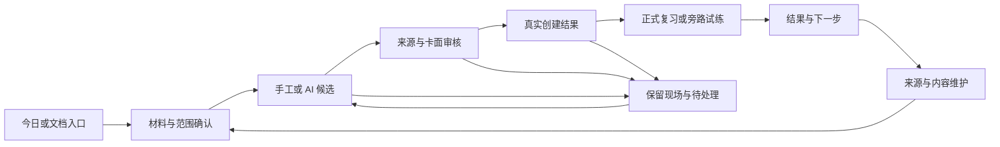

# 小驴闪卡 · 产品体验优化与页面蓝图

> 版本：体验规划 v1.1（2026-10-02，R52 原型质感与场景夹具）
>
> 依据：[27 产品使命](./27-产品使命与全功能战略.md)、[28 用户逻辑](./28-用户逻辑与终局产品模型.md)、[29 AI 战略](./29-AI战略与内置提示词体系.md)、[30 执行顺序](./30-待办治理与执行顺序.md)。本轮以 v0.63.0 源码静态审阅和产品经验提出规划，并对本地 Starline 评审稿做了有限的浏览器交互冒烟；没有插件页面/真机实测、外网竞品实测、模型调用或功能开发。
>
> 产出：**10 个页面任务蓝图、29 组已有验收深化、7 个 BX 切片和 1 个 BY 场景夹具条目**。BY-1 继续归入现有 38 工作包；E-01—E-29 是验收补充，不另计 checkbox，也不改变旧主归属/勾选状态。研究假设需用户任务验证，不能用本报告宣称功能已经支持。

## 1. 先改善用户如何完成一件事

全面的闪卡产品要让用户清楚“现在学什么、依据什么、怎样作答、怎样判断、何时结束、以后怎样维护”。界面应减少用户在模块、来源和配置之间反复搬运信息的工作。

本轮优先抓五件事：材料范围可见可改；创作前看到实际复习效果；学习方式与正式调度分开；结果能回到证据和修复；设置、AI 与复杂能力按用户任务逐步展开。AI 在每一环可以提建议、给候选或解释依据，但用户仍能通过手工和规则完成同一个目的。

页面的通用契约：

- 进入时说明目标、来源/范围、当前模式；退出时保留返回点或解释会丢失什么。
- 每阶段有一个明确下一动作；答案态的各评分按钮同级可选，不强行推荐一个正式评分。
- 每个状态就近显示可执行动作；空、加载、旧数据、失败、未知、缺能力分别说明。
- 页面只展示用户需要的理由、范围、时间、费用和限制；原始接口名、schema、trace 进诊断详情。
- 创建/同步/报告/联动结果可追溯到真实对象；建议、计划、候选与“已经完成”分开。
- 宽屏能并列查证，窄屏按同一对象分面，不能为了适配而丢失来源、作答或焦点。

## 2. 当前断点与证据

以下是源码/规格证据，不代表已在用户设备复现；优先补已有验收，再决定实现切片。

| 断点 | 静态证据 | 用户影响 | 规划归属 |
|---|---|---|---|
| 总览先给大量统计，下一步分散 | `src/ui/dashboard.svelte:279` 后六组数字、热力图、里程碑等纵向排列 | 用户想学五分钟，却要自己寻找开始点 | E-01，BI-2/6/12 |
| 切中心页重建组件，返回场景不统一 | `src/ui/hub.svelte:69` 的 key 重建，manager 本地状态；管理与复习的来源跳转精度不同 | 编辑后可能需重找查询/卡片 | E-02，BI-17/BW-5/11/AP-02 |
| AI 来源区缺原文输入与预览 | `src/ui/ai-wizard.svelte:208—225` 只有载入按钮与 token 粗估 | 看不到材料，也难裁剪外发范围 | E-03，AQ-18/BU-36 |
| 默认全部候选选中，审核与勾选未区分 | `ai-wizard.svelte:137,262—277` | 可编辑文本不等于已经审阅或看过真实卡面 | E-04/05，BU-14 |
| 单卡重生成没有传当前卡或修改意图 | `ai-wizard.svelte:146—159` 传整材料 + count=1，再直接替换 | “改这张卡”可能成为“换一个知识点” | BX-2；旧 Q-06 保留历史，补重验 |
| 管理过滤一页，却显示全库总数 | `src/ui/manager.svelte:31,56,96,217` | 用户可能把本页未命中理解为全库不存在 | E-06，BW-1/AS-5 |
| 手势评分的揭晓前后守卫冲突 | `src/ui/review.svelte:796` 在答案态返回，问题态滑动调用 rate；`529` 又拒绝未揭晓评分 | 源码显示两阶段都不能完成该横滑评分路径 | E-08，AS-2/AQ-2 |
| 宽松字符串规则可能忽略关键符号 | `src/core/card-types.ts:29—64` 删除标点及全角区字符，LCS 以期望长度为分母 | 小数/负号/额外错误命题可能得到误导性相似提示 | E-09/BX-1，不代替用户评分 |
| 模式是多个全局开关并隐式互斥 | `settings.svelte:350—362` 与 `review.svelte:965—980` 的 typing/choice 分支 | 英语、代码和临时练习难有不同偏好 | BX-3 |
| 成功后直接关闭，设置也缺效果预览 | `ai-wizard.svelte:189—190`、`settings.svelte:238—244,249—576` | 用户不清楚下一步或选项会影响什么 | E-20、BX-4 |

## 3. 十个页面任务蓝图

这里的“页面”包括 Tab、抽屉、侧栏、任务步骤和展开面，不要求新增十个顶级入口。当前 Hub 仍只有总览/管理/可选考试；未来入口按任务验证逐步引入。

| 任务面 | 用户来做什么 | 首屏应给什么 | 主动作与完成落点 | 承载建议 / 对应规划 |
|---|---|---|---|---|
| 今日行动工作台 | 决定此刻如何学 | 目标、可用时间、到期、未完成现场、一个建议及原因 | 继续/开始/只整理→进入选定模式；无到期可正常结束 | 总览上层，统计展开；E-01、BX-3 |
| 材料整理工作面 | 决定哪些值得记、哪些不外发 | 可编辑材料、来源位置/版本/许可、选区与重复提示 | 留来源/裁剪/转候选→审核；返回原阅读点 | 快速任务 Dialog，长材料任务 Tab/侧栏；E-03、E-28、BX-7 |
| 制卡与审核工作台 | 检查卡是否准确、可用 | 同一卡的来源、字段编辑、实际问题/答案预览、问题与审阅状态 | 修改/接受/稍后/拒绝→实际创建结果 | 宽屏并列，窄屏同对象分面；E-04/05、BX-1/2 |
| 专注复习面 | 先主动回忆，再决定正式自评 | 当前范围/模式、必要条件、题面、输入或提示、单一阶段动作 | 揭晓→用户评分；旁路练习结果另记→小结 | 现有 review 改层级；E-08/09/10/15、BX-3 |
| 学习对象详情 | 查清内容、来源、历史和问题 | 内容/来源/记录/问题四区，显示事实来源与未知 | 查证/原块编辑/提异议→回原列表/会话 | 优先现有详情抽屉；E-07/14/27 |
| 目标与课程计划 | 看范围、投入和完成定义 | 目标、阶段、前置、时间预算、缺口、建议变化 | 预演/缩范围/确认计划→开始相应任务 | 扩展已有考试面，课程逐步启用；E-12/28、BA |
| 结果与下一步面 | 确认做成了什么、以后怎么办 | 真实创建/待审/失败、正式复习与旁路摘要、对象位置 | 试练/回源/补材料/维护/收工，均可跳过 | 创建/复习/Agent 各复用结果结构，事实分别拥有；E-20/21 |
| 待处理与恢复面 | 找未完作业、内容问题、同步恢复 | 状态、对象、影响、检查点、可继续/补偿/跳过动作 | 进入原任务→处理完返回；权限问题直达控制 | 今日卡/命令打开任务面，不强制数据 Tab；E-26/29 |
| 偏好与隐私面 | 找设置、试效果、决定适用范围 | 可搜索分组、覆盖来源、生效时机、脱敏预览、变更数 | 试用/恢复单项/保存/取消；保存失败留草稿 | 设置 Dialog 短任务 + 长配置任务面；BX-3/4/6 |
| 学习与帮助演练面 | 学会怎么选材料、写好卡、修坏卡 | 一个具体任务、公开样例、操作理由、人工/固定AI样例 | 做一遍/跳过/退出/清理；迁入真实队列需显式动作 | 首用/相关空态/上下文帮助按需进入；BX-5、E-25 |

五条关键旅程应先做低保真/人工任务观察：首次从材料做卡；只有五分钟开始复习；觉得答案有误；批量生成中断；离开很久后返场。观察成功/取消/失败/缺依赖，不把看懂截图当可用性通过。

## 4. 29 组既有验收深化

以下每组引用旧 ID，只有验收范围更具体，不另建同义待办。责任包指本次用户体验的主要组织者；旧条目在 `31` 中的主归属仍保留。跨模块共用一个画面，不意味着合并事实源。

### E-01 今日行动入口

旧项：BI-2、BI-6、BI-11、BI-12；组织包：`WP-goal-journey`；阶段：W2。

总览首屏呈现继续现场、到期复习、整理材料、处理疑问；动作带范围、模式、投入与结束条件，统计渐进展开。

验收：新用户/有到期/无到期/有现场均有一个明确下一步；推荐可关，缺数据不制造负担或自动改 due。

### E-02 上下文轨迹与精准返回

旧项：BI-3、BI-17、BW-5、BW-11、LEGACY-AP-02；组织包：`WP-goal-journey`；阶段：W2。

任务→列表→详情→原块→返回保持对象、查询、范围、页码、滚动与焦点；错误边界重建与用户状态保存分开。

验收：管理与复习往返可定位具体块；源删除有退路；各旧 ID 主归属不因同一导航链而重分配。

### E-03 可读可改的来源工作面

旧项：AQ-18、BU-36、LEGACY-AP-43、AR-8；组织包：`WP-ai-egress`；阶段：W1→W3。

材料清单+原文编辑/片段预览，载入明确追加/替换、移除/清空、重复/分批与权限；不能只给 token 估计。

验收：预览范围与实际请求对齐，未同意不发；从本地裁剪到手工建卡无需模型。

### E-04 来源、字段、实际卡面联动预览

旧项：LEGACY-N-03、AY-6、BH-4、BK-14；组织包：`WP-card-authoring`；阶段：W2→W3。

编辑候选时查看真实问题态/答案态及引用；宽屏并列，窄屏按同一卡身份切面。

验收：问答/挖空无答案泄漏，用户编辑后渲染一致；字段/模板能力不足不伪装官方卡型。

### E-05 选中与已审分离

旧项：AQ-16、BU-14、BU-42；组织包：`WP-ai-quality`；阶段：W3。

审核区分待审/有问题/已编辑/已接受/稍后/拒绝，来源随手查证，可跳到下一个问题并保存进度。

验收：默认勾选不等于审核；需通过该任务审阅规则才提交；抽样只在明确低风险策略允许时使用，不静默放行。

### E-06 全库检索和批量范围一致

旧项：BW-1、BW-5、AS-5、AR-8；组织包：`WP-management-search`；阶段：W2。

搜索、分页、匹配总数共用同一结果集；筛选 chip、清除、全选本页/全部结果/指定数可见。

验收：目标只在第二页、状态筛选空结果、改筛选后旧选择、跨页全选四例不误导；无全库能力时注明仅当前页。

### E-07 学习对象详情与修订入口

旧项：BW-11、BI-20、BI-24、AQ-12、AR-9；组织包：`WP-management-search`；阶段：W2→W4。

内容/来源/学习记录/待处理问题按需展开；正式 due、本地观测、候选、内容健康分别解释；直达原块修订并返回。

验收：缺字段显示未知/N/A；过时不冒充遗忘，人工标记不冒充内核掌握。

### E-08 复习动作按揭晓阶段组织

旧项：AQ-2、AS-2、AS-3、BI-14；组织包：`WP-review-study-experience`；阶段：W1→W2。

主操作固定为揭晓/正式自评；编辑/回看/改期/今天不学收在可发现次级区；问题态只揭晓，答案态才评分。

验收：横滑前后、纵滚动、选区、链接、代码、输入控件不误触；读取/选择文字不自动揭晓。

### E-09 作答原文与相似提示的真实性

旧项：BK-15、AY-14、LEGACY-D-02；组织包：`WP-card-authoring`；阶段：W1/W2→W4。

保留原答、正常化过程与规则版本；字符相似不等同专业正确，额外否定/错信息与关键符号不能忽略。

验收：-1/1、1.2/12、全角输入、额外错误命题、空期望答案不误导；原始 diff 可读，正式评分由用户决定；数值策略引用 BX-1。

### E-10 干扰项不足时可降级

旧项：LEGACY-D-03、LEGACY-AP-30、BV-7；组织包：`WP-review-study-experience`；阶段：W2→W4。

0—3 个可信干扰项按实际二/三/四选或退自由回忆；可审阅干扰项来源、错因和可能多答案。

验收：不补无意义占位，不将排除占位选项判成掌握；异领域/重复/等价答案/缺答案均可解释。

### E-11 公式记忆与推导配方分开

旧项：BK-13、BV-10、BB-9；组织包：`WP-card-authoring`；阶段：W4。

公式回忆、变量单位、适用条件、缺步、错推导定位分别出题；标定义域/假设/参考步骤。

验收：条件不成立、单位不一致有手工例子；手写/文本可对照，缺证明待核实，不用 OCR/字符串相似代替数学证明。

### E-12 步骤中的条件、分支和停止

旧项：BJ-7、BB-3；组织包：`WP-application-outcomes-statistics`；阶段：W4。

区分必做、条件分支、可交换、禁止步骤与中止/升级处理；先选路径并解释依据，再揭晓。

验收：两条分支和停止条件的人工案例可完成；不适用步骤不算遗漏，专业判断缺可信 rubric 时手工。

### E-13 开放回答的逐要点证据

旧项：BJ-8、AY-4、BV-8；组织包：`WP-application-outcomes-statistics`；阶段：W4。

原答/参考要点/引用并列，逐点标已体现/缺失/不确定/已提示/不适用，保留标准版本和用户修正。

验收：同义、部分正确、互相矛盾、材料不足均保留证据；要点数量不自动折算 rating/整体掌握率。

### E-14 内容异议可离开评分链

旧项：AR-9、BC-12、BI-21；组织包：`WP-content-maintenance`；阶段：W2→W4。

觉得答案错/题有歧义时记录当时版本、理由和引用，可继续/跳过内容/进维护；修复回看旧新题。

验收：提交问题可取消/重试且不重复，不修改既往评分；内容异议不解释为记不住。

### E-15 示范到独立作答的支架

旧项：BA-15、BJ-17、BU-38；组织包：`WP-review-study-experience`；阶段：W4。

完整示范→缺步→关键提示→独立作答，用户选支持层，记录已揭示范围。

验收：各层可退出/重试，不用一次正确强制升级，不为示范查看评分；AI删提示仍须同来源与反泄漏验收。

### E-16 关系断言可以被练习与纠正

旧项：BK-2、BB-2、BJ-5；组织包：`WP-content-object-model`；阶段：W4。

关系类型/方向/条件/出处/确认状态明确；用必要/充分、规则/例外、因果/相关与反例卡练关系。

验收：修改关系先预览影响，未确认关系不能自动建正式卡，全库自动挖掘后置。

### E-17 按任务选择 AI，参数渐进展开

旧项：BU-34、BU-5、BV-2、BV-4；组织包：`WP-ai-quality`；阶段：W3。

用关键制卡/理解材料/改好卡等当前可用任务描述输入、产出、示例与推荐理由；provider共用目录，模型参数进高级区。

验收：手动改选不扩大外发范围；首批仅问答/挖空也可用，缺模型退人工/规则配方。

### E-18 未知与冲突显示在内容旁

旧项：BU-10、BU-11、BV-3、BO-5；组织包：`WP-ai-quality`；阶段：W3→W4。

材料不足/来源冲突/术语不清/格式失败就近显示，并列条件证据与补材料/回源/待核实动作。

验收：不用置信百分比冒充事实可信度；无法核实保留未知与手工标记。

### E-19 跨阶段交接可删除的任务摘要

旧项：BI-3、BI-17、BU-32、BU-36；组织包：`WP-goal-journey`；阶段：W2→W3。

进入解释/改卡时带目标、限定来源、当前对象、用户已确认错因、保护项、未决问题和返回点；可逐项移除。

验收：完成后可清除，不隐式成为长期画像；AI发送只含本次允许的摘要，手工同样使用。

### E-20 作业阶段、结果与下一步

旧项：AQ-14、AQ-17、BU-24、BU-30、BU-39；组织包：`WP-ai-jobs`；阶段：W1取消→W3。

材料检查/等待/生成/待审/写入/部分成功分别呈现；结果列真实创建/待审/失败/未执行与目标落点。

验收：未知进度不造百分比，取消保留草稿并说明已有请求；恢复不重复；试练/回源/继续审核/收工不靠toast消失；Agent只引用真实工具结果。

### E-21 统计有证据下钻和修复动作

旧项：AS-11、AQ-12、AQ-13、BT-6、BV-23、BW-7；组织包：`WP-application-outcomes-statistics`；阶段：W2→W4。

摘要→时间窗/分母/缺失→关联对象→查看/维护/不处理；图表提供文本/表格等价。

验收：无样本/小样本/截断历史与返回有记录；不可点击行不显示可点击暗示，经验曲线不是个人预测/因果结论。

### E-22 视觉层级服务于阅读和操作

旧项：AS-6、AS-8、LEGACY-AL-13、LEGACY-G-07；组织包：`WP-ui-accessibility-platform`；阶段：W2持续。

任务/内容/元信息有稳定层级；静态状态不用持续呼吸；低端与窄屏可纯色无blur；颜色不能单独表达风险或评分。

验收：亮暗/第三方主题、焦点、高对比、reduced-motion/低端截图检查；主题派生不等于自动合格，学习按钮不被动效遮挡。

### E-23 键盘、输入法、焦点与动作同义

旧项：AS-1、AS-3、AS-4、LEGACY-Z-02；组织包：`WP-ui-accessibility-platform`；阶段：W2持续。

输入法composition、回车候选选词、数字输入、文本选择和弹层关闭分别处理；图标有文本/键盘等价与禁用原因。

验收：中文输入不意外提交/评分，关闭焦点回调用入口，触控/键盘无hover也能找次级动作，Esc不误丢草稿。

### E-24 长内容和软键盘下布局不中断

旧项：AS-2、BG-8、BG-9、LEGACY-R-02；组织包：`WP-ui-accessibility-platform`；阶段：W2持续。

320px/字号放大/软键盘/safe-area/横竖屏/长表格代码字幕分面展开；当前任务动作可达。

验收：不隐藏待提交输入、焦点或必要按钮；窄屏与桌面保持同一卡身份，不靠单个横向长工具条。

### E-25 空、失败、未知与能力缺失各有下一步

旧项：AR-8、AU-6、LEGACY-AH-02；组织包：`WP-ui-accessibility-platform`；阶段：W2持续。

空库→试样例/建卡，筛选空→清筛选，模型未配→演练/手工，权限不足→范围说明，网络失败→保留草稿/重试。

验收：同一区域唯一主状态，旧数据带更新时间；按原因给动作，不统称内核无响应、不把未知显示成0。

### E-26 待处理任务面聚合作业而不混合事实源

旧项：BL-3、BL-5、BL-10、BI-25、BQ-3；组织包：`WP-goal-journey`；阶段：W2→W3/W5。

从今日/命令进入待处理面，展示作业、内容问题、同步/恢复与权限的对象、影响、检查点和合法动作。

验收：页面聚合不另建事务/备份/权限账本；取消/撤回/外部失败不冒充完成，能打开相应原任务并回到现场。

### E-27 适用条件与版本并存

旧项：BO-6、BC-3、BI-24；组织包：`WP-content-maintenance`；阶段：W4。

卡面保留必要前提，维护中比较地区/版本/对象/生效期/条件后再判断冲突；支持同断言多个范围同时成立。

验收：日期缺失未知；过期只触发维护建议，不自动暂停/改评分；先手工两版本案例，自动权威更新后置。

### E-28 创建前的数量与学习投入预演

旧项：BA-11、BV-1、BV-5、BI-12；组织包：`WP-goal-journey`；阶段：W2规则→W3AI。

关键最少/数量上限/覆盖优先，分解材料重点、方向/变体、拟创建量、重复排除与预估投入。

验收：优先已观察数据，粗估显式假设，缺历史未知；不凑张数、不由AI虚构未来due/精确FSRS负担；用户可减量/只留来源。

### E-29 按设备与来源显示离线可用清单

旧项：BN-2、BG-4、BG-2；组织包：`WP-data-integrity`；阶段：W2状态→W4媒体准备。

显示本地可用/待同步/过期/冲突/缺媒体及最后检查点，区分素材可读、核心内核可达与AI不可用。

验收：仅有缓存不宣称可正式离线评分；远程Kernel不可达退只读/旁路；准备下载需授权，清理不静默删离线原件。

## 5. 七个值得独立登记的新增切片

数值政策、定向改写、本场偏好、设置预览是已有方向下有独立交付对象的切片；演练、临时展示和伴随侧栏是待用户任务验证的产品提案。它们不另建平台，继续复用内容、事务、AI、隐私与 UI 底座。

### BX-1 可检查的标量数值答案政策

主归属：`WP-card-authoring`；优先级：P2；阶段：W4；原始作答与符号风险先按 E-09 在 W1/W2 处理。已有依赖/边界：BK-13、BK-15、AY-14、BV-10。

为数值卡记录规范单位/允许单位、绝对或相对容差、零值附近规则、有效数字、百分数与小数分隔约定；保留原答和策略版本，展示转换与不能判定项。

最小验收：覆盖 -1/1、1.2/12、0 附近容差、单位换算、百分数和歧义格式；未知单位/表达式退手工，策略变更保留旧版本，不将匹配结果自动提交为正式评分。

AI 与替代：只提出答案策略候选与必要条件，用户确认；符号代数/自动证明后置。 无 AI/能力不足：原答与参考答案并列，自评。

### BX-2 保留知识点与人工字段的定向局部改写

主归属：`WP-card-authoring`；优先级：P1；阶段：W3；人工局部编辑/差异预览可先进入 W2。已有依赖/边界：LEGACY-Q-06、BU-15、BK-9、BV-19。

用户选问面/提示/解释区域及缩短、补条件、换例子等意图，锁定人工字段和限定来源；输出先对照差异，再逐项采用。

最小验收：拒绝或取消保留原卡，不能静默换知识点/数值/专业结论；拆分形成新候选并预览影响；事实修订转维护审核，版本与撤销复用 BU-15/BK-9。

AI 与替代：提示词输入当前卡身份/知识点/选区/意图/锁字段/来源，返回字段 diff、未决项或拒绝原因；通过本任务 G3-call/quality。 无 AI/能力不足：手工局部编辑和差异确认。

### BX-3 本场学习偏好的作用域与互斥预设

主归属：`WP-review-study-experience`；优先级：P1；阶段：W2 本场互斥覆盖；W4 范围预设。已有依赖/边界：BI-2、LEGACY-AC-05、AT-10、BH-5。

区分全局默认、目标/范围偏好、本场覆盖，展示生效值与来源；自由回忆/打字/听写/选择互斥，本场切换不改全局。

最小验收：typing/choice 冲突可解释，听写无音频给替代；结束本场恢复默认，跨窗口只同步声明范围的偏好；不改变内核 due 或将练习模式当正式调度模式。

AI 与替代：可以说明模式适用性，但需用户选择，不自动变更。 无 AI/能力不足：自由回忆与原生复习。

### BX-4 偏好搜索与脱敏本地效果预览

主归属：`WP-ui-accessibility-platform`；优先级：P2；阶段：W2 偏好查找；W4 完整预览。已有依赖/边界：BH-10、LEGACY-AC-02、LEGACY-AC-05、AT-10、AS-6。

按用户任务搜索听写/音效/字号等设置，结果显示分组路径、覆盖来源、禁用原因与生效时机；字号/密度/声音用本地样例试用，保存区显示变更数。

最小验收：预览后取消不写真实偏好或评分；声音预览显式播放且可停止；可恢复单项，未知设置给帮助；保存失败保留草稿，秘密字段不进入样例。

AI 与替代：可用规则解释设置，AI 为可选说明且不读密钥/自动保存。 无 AI/能力不足：分组目录、手工搜索与静态样例。

### BX-5 隔离真实学习数据的坏卡修复教学演练

主归属：`WP-support-discovery-education`；优先级：P2；阶段：W2 首个可操作演练；W3 AI 样例；W4 领域扩展。已有依赖/边界：LEGACY-AG-03、BE-2、AU-6、BU-40。

用公开许可/虚构材料走材料筛选→辨认坏卡→修改→试练→应用→维护，具独立演练身份、进度、退出重开与清理范围；无 key 也能用固定 AI 样例学审核。

最小验收：默认不建真实卡、不产生正式评分/模型费用，固定响应标明演示；可跳过退出清理，只在用户明确选择后迁入经审核的内容候选；演练评分/完成进度不迁成真实回忆或应用证据，清理只删除本演练身份所属对象，不删除迁入后独立存在的真实对象；专业案例仅演示操作，不宣称专家核验或学习效果。

AI 与替代：固定样例演示不足/冲突/额度耗尽及人工替代；真实模型须另走同意与门禁。 无 AI/能力不足：全程人工练习配方和静态操作说明。

### BX-6 临时演示与投屏的私密展示模式

主归属：`WP-privacy-consent-controls`；优先级：P2；阶段：W4 概念验证后按范围实现。已有依赖/边界：BC-13、BL-5、BU-32。

按用户选择临时遮蔽插件界面的姓名、来源路径、目标名、日期、预览缩略图和旁路通知；保留必要的模式/状态与退出入口，不修改原始内容。

最小验收：复习/详情/结果/设置的声明遮蔽范围一致，读屏标签及插件通知同样遵守；用户可预览与立即退出，不改变访问权限或发送范围，不宣称能阻止系统截图/宿主其他界面泄露。

AI 与替代：不自动识别并外发私密内容，遮蔽规则不解除来源 deny。 无 AI/能力不足：只使用已脱敏演练数据或手工隐藏相关面板。

### BX-7 跟随文档与选区的伴随学习侧栏

主归属：`WP-capture-inbox`；优先级：P2；阶段：W2 低保真任务验证；W4 宿主能力验证后实现。已有依赖/边界：BI-3、BI-4、BI-17、BW-1、AW-3。

阅读时按明确启用的文档/选区显示已有相关对象、未决疑问、收件箱与建卡入口；保持具体块/阅读返回点，只读跟随不自动生成或写入。

最小验收：切文档/选区、来源只读/删除、窄屏与关闭侧栏均能回原任务；手动锁定范围不被跟随覆盖，无假关联/无后台外发；宿主无稳定侧栏接口时退块菜单/命令入口。

AI 与替代：用户主动选择解释/提炼后才检查该选区的上下文同意与本任务门禁。 无 AI/能力不足：当前块菜单、来源详情和手工捕获。

## 5.1 R52 原型质感与跨任务场景夹具

R52 将十个任务面放入同一份 Starline 交互目标原型（[starline-r52.html](./prototypes/starline-r52.html)），用固定虚构数据检查页面节奏和状态语义。原型支持桌面/窄屏、亮/暗主题、任务切换，以及正常、加载、部分成功、失败、待核对等状态；不连接思源、不调用模型、不保存卡片或评分。它是评审材料，不等于插件页面已实现。

本轮查重后只增加 `BY-1 跨任务视觉场景与状态夹具评审器`（主包：`WP-ui-accessibility-platform`，P1）。评审器需让每个任务面在固定脱敏 fixture 下切换视口、主题、状态和长内容，输出视觉回归截图并执行 DOM/a11y 检查；没有评审器时以静态 PNG/HTML 状态卡和人工核对降级。它不读取真实数据、不调用模型、不写入真实卡片或评分，也不新增顶级页面。

为实现原型质感，既有条目的验收范围进一步明确：

- `LEGACY-AG-02`：组件画廊之外必须能从任务面进入场景夹具，看到状态切换和“固定虚构数据”说明；
- `LEGACY-AG-05`：页面状态 fixture 纳入快照、结构和异常状态检查；
- `LEGACY-G-14`：每次视觉改动检查主题、对比度、焦点、窄屏和 `prefers-reduced-motion`；
- `LEGACY-N-03` / `E-04`：审核工作面必须出现实际卡面预览，且与来源字段同对象联动；
- `LEGACY-T-03`：详情、审核和结果抽屉支持同一返回点与上下文恢复；
- `AQ-17` / `AR-2`：长任务草稿、退出前保存、异步失败后的恢复动作可见；
- `BI-3` / `BI-17`：跨材料、结果和待处理面返回时恢复原块、选区和任务摘要。

以下三组发现已完成查重，不另建条目：材料/编辑/卡面分栏继续归 `LEGACY-N-03`、`LEGACY-T-03`、`AS-2`、`AS-6`；长任务草稿、自动保存与退出恢复继续归 `LEGACY-C-13`、`AQ-14`、`AQ-17`、`AR-2`、`AQ-4`、`BI-30`；组件/页面状态样例库继续归 `LEGACY-AG-02`、`LEGACY-AG-05`、`G-14`。上述条目的验收范围扩大，但不重复增加 checkbox。

## 6. 页面、文案和视觉细节的统一规则

| 维度 | 应优化的行为 | 需要验证的边界 |
|---|---|---|
| 信息层级 | 页面标题说明当前任务，范围/模式紧邻；核心内容优先，原始系统状态在详情 | 新手不被设置/统计淹没，熟练者仍能搜索高级能力 |
| 视觉层级 | 中性阅读面、稳定字阶/间距、少量语义强调；数字不抢题面 | 不以渐变、模糊、阴影作为信息载体，低端可降级 |
| 动作真实性 | 按钮/可点击行/箭头只对应真实可执行动作；禁用解释原因 | 没有 handler 的统计行不暗示可点击，不能靠 hover 才能发现关键动作 |
| 状态语言 | “12 张待审”“已创建 8 张，2 张失败”“此处缺原生耗时” | 不写虚假完成/进度/掌握；原文与系统错误不直接替代用户可理解的原因 |
| 学习反馈 | 区分内容错误、没理解、没记住、使用提示与未知 | 不因任务异议或查看解释自动提交遗忘，不以自动建议替用户正式评分 |
| 编辑动作 | 保存/取消/恢复单项/局部采用差异可见，提交中防重复 | 长文本与输入法不误提交，失败留原答和草稿 |
| 注意力 | 仅任务状态变化用必要动效；可关闭庆祝、声音、提示与 AI 等待 | 默认静态状态点，reduced-motion/高对比/无声音均能完成流程 |
| 布局连续性 | 次级面有返回点，软键盘下关键动作可达，长答案分层 | 读屏知道当前面和揭示层，字号放大与窄屏不丢来源/焦点 |
| 内容教学 | 给好卡/坏卡/改法/为什么不建卡的例子，而非只有按钮说明 | 权利清晰、脱敏、任务级演练隔离，专业例子不冒充专家结论 |
| AI 可理解性 | 先任务，再范围/预算，再审核与真实结果；能拒绝/手工继续 | 显示实际 provider 与费用/估算，固定样例标示例，所有变体只是拟定未注册 |

品牌可以保持星轨的秩序、留白和细节，但“最全面”首先体现为流程和内容覆盖。宣传重点是用户能完成的具体任务及当前限制；本报告中的十种任务面和新能力不能直接写成已支持。

## 7. 验证和顺序建议

| 阶段 | 优先验证 | 不应等待的内容 |
|---|---|---|
| W1 现版真实断点 | 翻面/手势、来源范围、取消/重载、原答与相似提示风险 | 完整页面重构、全部新卡型或全部 AI 模板 |
| W2 可用手工主链 | 今日→材料→实际预览→复习→结果→原块；全库搜索/返回点/模式互斥；一个演练 | Agent、未来 V2 策略、完整多媒体 |
| W3 首个可信 AI 切片 | 任务选择、实际来源、已审状态、定向改写、作业恢复与落点 | 全局 AI 中心或全部 BV；门禁按本任务 |
| W4 领域与体验深化 | 数值、条件/分支/关系/证据、范围偏好、临时展示/伴随侧栏 | 自动证明、全库关系挖掘、专业自动判分 |
| 持续验证 | 键鼠触/读屏/输入法、320px/软键盘/主题、低网/返回/失败、内容许可 | 无关的市场/云/多人能力 |

用户研究先记录任务完成、误操作、找不到入口、取消/恢复与额外搬运信息的次数；这是流程证据。记忆、解释、应用与因果结果仍用 BT/BW-7 的研究设计另行取证，不能从按钮少、界面好看或 AI 接受率直接推断。

R50 历史新增 7 条，R52 增加 BY-1 1 条；既有条目的状态与主要归属保持。当前总数为 **922（已勾选 177、普通未完成 742、特殊 3，未完成含特殊 745）**，共 77 组、38 个工作包。后续只有任务证据支持时才进入开发；此处不承诺版本、工期或已实现状态。

